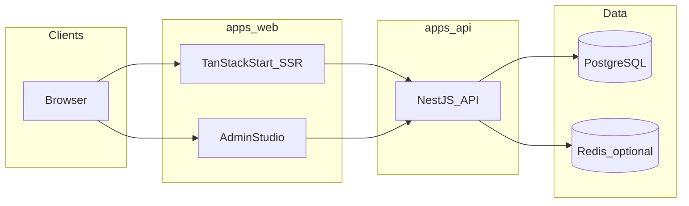

# Development roadmap: fullstack Blog/CMS (NestJS + TanStack Start + Nx)

Этот документ — **master-план разработки** репозитория: от пустого монорепо до production-ready платформы. Он дополняет [learning-path.md](./learning-path.md) (обзор фаз для студента) и задаёт **нумерованные шаги (спринты)**, каждый из которых должен иметь отдельный файл урока в `docs/lessons/`.

## Целевая система

- **Backend**: NestJS API — аутентификация, RBAC, CMS (посты, теги, категории, комментарии, модерация), валидация, ошибки, наблюдаемость.
- **Frontend (public)**: TanStack Start — SSR/SEO, лента и страница поста, метаданные, sitemap.
- **Frontend (admin)**: TanStack Start — студия/редактор постов, черновики, превью, публикация.
- **Monorepo**: Nx — приложения в `apps/`, общие библиотеки в `libs/`, единые lint/test/typecheck, CI.

## Текущий baseline репозитория (аудит)

| Область | Состояние |
|--------|------------|
| NestJS приложение | Каталог [`app/`](../app/) — стандартный bootstrap Nest 11 |
| Корневой `package.json` | Отсутствовал — шаг **001** вводит npm workspaces |
| Frontend | Нет — появится в Track 0 / Track 4 |
| Nx | Нет — инициализация в шагах **002–006** (см. индекс) |
| Документация | `docs/` — learning path, authoring guide, шаблон урока |

## Целевая структура каталогов (ориентир)

```text
apps/
  api/          # NestJS (миграция из app/)
  web/          # TanStack Start — public + admin routes
libs/
  shared-contracts/   # DTO/types, OpenAPI или zod-схемы
  shared-config/      # env, флаги
  ...
```

Детальная разбивка фиксируется в уроках по мере прохождения шагов.

## Архитектура потоков



## Контракт одного шага (урок-спринт)

Каждый шаг **N** имеет файл `docs/lessons/lesson-NNN-*.md` (нумерация = ID шага) и **обязан** содержать:

1. **Learning Goal** — что изучаем и зачем.
2. **Implementation Scope** — какие изменения в коде.
3. **Dependencies** — пакеты, сервисы, версии.
4. **Step-by-Step Changes** — воспроизводимые действия.
5. **Verification** — команды и/или тесты + ожидаемый результат.
6. **Changed Files** — созданные/изменённые файлы.
7. **Architecture Notes** — решения и trade-offs.
8. **Definition of Done** — измеримые критерии приёмки.

Дополнительно: связь с предыдущим шагом, mini-homework (по [lesson-authoring-guide](./lesson-authoring-guide.md)).

## Нумерация и треки

| Track | Название | Диапазон шагов |
|-------|----------|----------------|
| 0 | Workspace Foundation | 001–032 |
| 1 | Platform Core & Architecture | 033–056 |
| 2 | Auth & Identity | 057–104 |
| 3 | CMS Domain & Editor Backend | 105–164 |
| 4 | TanStack Start Public Site | 165–200 |
| 5 | Admin Studio & Editor UX | 201–252 |
| 6 | Data, Scale & Performance | 253–278 |
| 7 | Reliability, Security, Observability | 279–302 |
| 8 | Delivery & Productization | 303–320 |

## Master step index

Колонка **Verify** — минимальная проверка; в уроке она расширяется до точных команд и ожидаемого вывода.

### Track 0 — Workspace Foundation (001–032)

| Step | Title | Verify |
|------|-------|--------|
| 001 | Root `package.json`, npm workspaces, скрипты оркестрации | `npm install` + `npm test` с корня |
| 002 | Зафиксировать версии Node/npm, документ LOCAL_SETUP | документ + `node -v` |
| 003 | Инициализация Nx в корне (`nx init`) без поломки Nest | `npx nx graph` или `nx --version` |
| 004 | `nx.json`, `package.json` targets, inference для Nest | `nx show projects` |
| 005 | Перенос Nest: `app/` → `apps/api` (или генерация + копия) | `nx run api:build` |
| 006 | Корневые `tsconfig.base.json`, path mappings черновик | `nx run api:build` |
| 007 | Единый ESLint в корне (flat config), линт API | `nx run api:lint` |
| 008 | Единый Prettier, `.editorconfig` | `nx run api:format` или prettier check |
| 009 | Скрипты `build`, `test`, `lint` на корне через Nx | `npm run build` |
| 010 | `apps/web`: scaffold TanStack Start (минимальное приложение) | `nx run web:build` |
| 011 | Typecheck target для web | `nx run web:typecheck` |
| 012 | `libs/shared-contracts` — пустой пакет + экспорт типа | `nx run shared-contracts:build` |
| 013 | Подключение lib к `api` (ts paths) | `nx run api:build` |
| 014 | Подключение lib к `web` | `nx run web:build` |
| 015 | CORS и dev origin: договорённость портов (док + env) | ручной чек + e2e smoke |
| 016 | `compose.yaml`: PostgreSQL (dev) | `docker compose up -d` + health |
| 017 | `.env.example` корень + per-app | grep / документ |
| 018 | Root README: как запускать api + web | peer review чеклист |
| 019 | GitHub Actions: install, lint, test, build matrix | CI green |
| 020 | Кэш Nx в CI (`nx-cloud` опционально) | CI время / hit rate |
| 021 | Разделение `affected` в CI | `nx affected -t test` |
| 022 | Husky + lint-staged (опционально политика) | commit hook |
| 023 | Структура `docs/lessons` + нумерация под шаги | файл `docs/lessons/lesson-001-*.md` существует |
| 024 | Release версия v0.0.1 monorepo (changelog stub) | тег / запись |
| 025 | Нормализация `.gitignore` (dist, .nx, coverage) | git status clean |
| 026 | VS Code recommended extensions (опционально) | наличие файлов |
| 027 | Документ ADR-000: выбор Nx + TanStack Start | ADR файл |
| 028 | Документ threat-model stub | markdown |
| 029 | Smoke script: `curl` health (после появления endpoint) | curl |
| 030 | Капитуляция Track 0: чеклист приёмки трека | все DoD |
| 031 | Резерв: усиление CI (matrix OS / Node) | CI green |
| 032 | Резерв: документирование отклонений от индекса (ADR) | ADR merged |

### Track 1 — Platform Core & Architecture (033–056)

| Step | Title | Verify |
|------|-------|--------|
| 033 | `@nestjs/config`, `ConfigModule` глобально в API | unit test config load |
| 034 | Валидация env через `class-validator` + custom factory | fail fast при невалидном .env |
| 035 | Структурные модули: `CoreModule`, `HealthModule` | e2e GET /health |
| 036 | Контракт ошибки: единый формат JSON | snapshot тест filter |
| 037 | `HttpExceptionFilter` глобально | e2e 404 body shape |
| 038 | `ValidationPipe` глобально (whitelist, forbid) | e2e 400 body |
| 039 | Логирование: структурные логи (pino или встроенный logger) | log line assert |
| 040 | Correlation id middleware / interceptor | header roundtrip |
| 041 | Request timing interceptor | метрика в логе |
| 042 | Версионирование API `/v1` prefix | e2e |
| 043 | OpenAPI/Swagger (опционально по политике) | /api-json |
| 044 | `libs/shared-config` — shared env shape (types only) | build |
| 045 | Строгий `tsconfig` для API | build |
| 046 | API e2e базовый harness улучшения | e2e suite |
| 047 | Документ границ модулей (bounded contexts) | docs |
| 048 | Политика именования DTO/entities | docs |
| 049 | Капитуляция Track 1 чеклист | manual |
| 050 | OpenTelemetry: зависимости и no-op tracer в API | unit smoke |
| 051 | Trace context propagation (incoming headers) | integration |
| 052 | Подготовка `@nestjs/throttler` (без жёстких лимитов) | e2e noop |
| 053 | Политика публичных vs админ маршрутов (док) | review |
| 054 | Библиотека `libs/shared-contracts`: ошибки API enum | build |
| 055 | Согласование версий зависимостей в lockfile | `npm audit` triage |
| 056 | Резерв Track 1: усиление e2e стабильности (flaky hunt) | CI |

### Track 2 — Auth & Identity (057–104)

| Step | Title | Verify |
|------|-------|--------|
| 057 | Выбор стратегии auth (JWT access + refresh в httpOnly) | ADR |
| 058 | Зависимости: `@nestjs/jwt`, `passport`, `bcrypt` или `argon2` | install |
| 059 | `User` entity (TypeORM/Prisma — выбор на шаге) | migration |
| 060 | `UsersModule`, `UsersService`, хеширование пароля | unit test hash |
| 061 | Register endpoint + DTO | e2e 201 |
| 062 | Login endpoint → access + refresh | e2e 200 + cookies |
| 063 | `JwtStrategy` access token | e2e protected 401/200 |
| 064 | Refresh rotation + reuse detection policy | unit + e2e |
| 065 | Logout (invalidate refresh) | e2e |
| 066 | Roles enum + колонка в БД | migration |
| 067 | `@Roles()` decorator + `RolesGuard` | e2e 403 |
| 068 | Permissions fine-grained (опционально) | unit |
| 069 | Email уникальность, нормализация | e2e |
| 070 | Password policy | unit |
| 071 | Account lockout / throttle login (baseline) | e2e |
| 072 | `CurrentUser` decorator | e2e |
| 073 | Тестовые фикстуры пользователей | test helper |
| 074 | Sec headers baseline (через Nest или reverse proxy doc) | manual |
| 075–104 | Sessions/devices, OAuth stub, 2FA placeholder, security тесты | см. уроки |

### Track 3 — CMS Domain & Editor Backend (105–164)

| Step | Title | Verify |
|------|-------|--------|
| 105 | Модель `Post`: draft/published, slug, authorId | migration |
| 106 | CRUD черновиков (author) | e2e |
| 107 | Publish transition + валидация | e2e |
| 108 | Контент JSON (blocks) + schema version | unit schema |
| 109 | История версий / autosave (минимум snapshot) | e2e |
| 110 | `Tag`, `Category`, M2M связи | migration + e2e |
| 111 | Публичный read API (опубликованные только) | e2e |
| 112 | Пагинация + сортировка | e2e |
| 113 | Полнотекст / простой search (политика) | e2e |
| 114 | `Comment` модель, nested policy | migration |
| 115 | Модерация: очередь статусов | e2e |
| 116 | Slug collision handling | e2e |
| 117 | SEO поля: title, description, ogImage | unit |
| 118 | Кеширование публичных постов (stub) | unit |
| 119 | Webhooks / revalidate hook для frontend (контракт) | contract test |
| 120–164 | Медиа upload, image pipeline, reporting, bulk ops | уроки |

### Track 4 — TanStack Start Public Site (165–200)

| Step | Title | Verify |
|------|-------|--------|
| 165 | Маршруты блога: список, пост по slug | build + smoke |
| 166 | SSR data loader: fetch public API | integration |
| 167 | SEO `<title>` meta из API | e2e playwright |
| 168 | OpenGraph теги | HTML assert |
| 169 | sitemap.xml | GET 200 |
| 170 | robots.txt | GET 200 |
| 171 | RSS (опционально) | GET 200 |
| 172 | Pagination UX | test |
| 173 | Обработка 404 поста | test |
| 174 | Кеш и revalidate по событию публикации | integration |
| 175–200 | Поиск, теги, категории, performance budget | уроки |

### Track 5 — Admin Studio & Editor UX (201–252)

| Step | Title | Verify |
|------|-------|--------|
| 201 | Admin layout, auth gate на клиенте | test |
| 202 | Login form → API cookies/sessions | e2e |
| 203 | Post list (мои черновики) | e2e |
| 204 | Редактор: блоковая модель UI | unit component |
| 205 | Autosave debounce + conflict indicator | integration |
| 206 | Preview mode | manual + test |
| 207 | Publish flow | e2e |
| 208 | Модерация UI для ролей | e2e |
| 209–252 | Медиа picker, теги, категории, a11y, i18n stub | уроки |

### Track 6 — Data, Scale & Performance (253–278)

| Step | Title | Verify |
|------|-------|--------|
| 253 | Индексы БД под slug, status, publishedAt | explain analyze |
| 254 | Read replicas policy (док) | ADR |
| 255 | Redis cache слой | integration |
| 256 | CDN cache headers для public GET | header assert |
| 257 | N+1 query устранение | profiler |
| 258–278 | Пагинация keyset, bulk export, backup job stub | уроки |

### Track 7 — Reliability, Security, Observability (279–302)

| Step | Title | Verify |
|------|-------|--------|
| 279 | `@nestjs/throttler` | e2e 429 |
| 280 | helmet (если применимо к SSR) / proxy headers | security check |
| 281 | Health + readiness + liveness | k8s probe doc |
| 282 | Metrics Prometheus format | GET /metrics |
| 283 | Structured error rate dashboard spec | doc |
| 284–302 | OTel traces, log aggregation, pen-test checklist | уроки |

### Track 8 — Delivery & Productization (303–320)

| Step | Title | Verify |
|------|-------|--------|
| 303 | Dockerfile multi-stage API | image build |
| 304 | Dockerfile web SSR | image build |
| 305 | docker compose prod-like | smoke |
| 306 | Versioning semver + release doc | tag |
| 307 | Миграции как шаг деплоя | CI job |
| 308 | Secrets management policy | doc |
| 309 | Load test k6 baseline | report |
| 310 | Capstone: архитектурный обзор + tech debt ledger | review |
| 311–320 | Резерв: multi-region, DR drill | по необходимости |

## Связь с уроками

- Каждая строка таблицы = **один спринт** = один файл в `docs/lessons/lesson-NNN-slug.md`.
- [learning-path.md](./learning-path.md) даёт **фазы для чтения**; детальный порядок — только из этого файла.

## Первый исполняемый шаг

**Шаг 001** выполнен в коде и задокументирован в [lesson-001-root-npm-workspaces.md](./lessons/lesson-001-root-npm-workspaces.md).

---

*Документ живой: при отклонении от плана добавляйте ADR и обновляйте индекс шагов.*
