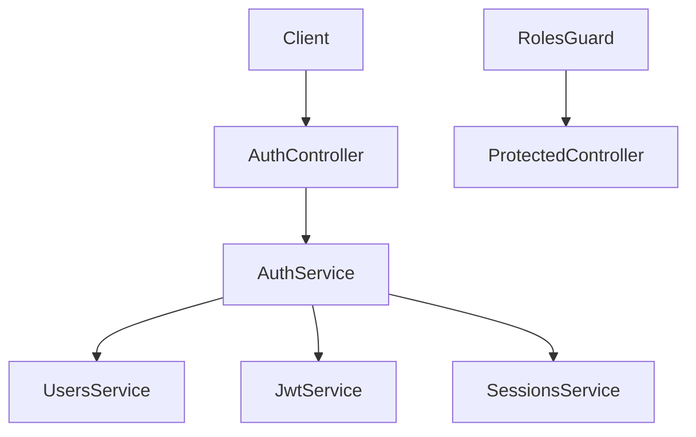

# Lesson 03: Auth Roadmap (Users, Roles, Sessions, JWT)

## Context

До CMS функционала нам нужен безопасный вход в систему. В этом уроке мы не пишем финальный auth-код целиком, а строим понятную схему реализации и контракты.

## Concept

Auth состоит из двух слоев:

- **Authentication**: подтверждаем личность пользователя;
- **Authorization**: ограничиваем действия по ролям/правам.

Для учебного сервиса используем гибрид:

- access через JWT;
- refresh через session-aware подход (контролируемые сессии).

## Architecture Snapshot



## Step-by-Step Implementation Plan

### Step 1 - Users module

Что делаем:

- создаем `users` модуль;
- храним user identity и password hash;
- готовим методы `createUser`, `findByEmail`, `findById`.

Пример сигнатур:

```ts
interface CreateUserInput {
  email: string;
  password: string;
  displayName: string;
}

findByEmail(email: string): Promise<User | null>;
```

### Step 2 - Auth module (register/login)

Что делаем:

- `register` создает пользователя;
- `login` проверяет пароль и возвращает токены;
- ошибки логина не раскрывают лишние детали.

Пример response:

```json
{
  "accessToken": "<jwt>",
  "refreshToken": "<refresh>",
  "user": { "id": "u1", "email": "user@example.com", "role": "author" }
}
```

### Step 3 - JWT guard

Что делаем:

- подключаем `passport-jwt`;
- извлекаем bearer token из `Authorization`;
- добавляем `JwtAuthGuard` на приватные роуты.

### Step 4 - Roles guard

Что делаем:

- создаем `@Roles(...)` decorator;
- в `RolesGuard` сравниваем роль пользователя с требуемой ролью endpoint.

### Step 5 - Sessions + refresh

Что делаем:

- храним активные refresh-сессии;
- endpoint `POST /auth/refresh` выдает новую пару токенов;
- endpoint `POST /auth/logout` завершает текущую сессию.

## Why This Matters

Эта схема дает баланс: быстрый stateless доступ через JWT и управляемое завершение сессий через refresh storage.

## What To Remember

- Логин и роли - разные задачи, не смешиваем.
- Не храним plaintext пароли.
- Refresh lifecycle должен поддерживать revoke.

## Verify

Минимальный сценарий проверки:

1. `POST /auth/register`
2. `POST /auth/login`
3. `GET /profile` с bearer token
4. `POST /auth/refresh`
5. `POST /auth/logout`

## Homework

Составь таблицу endpoint'ов auth с колонками: `route`, `public/private`, `required role`, `response`.
