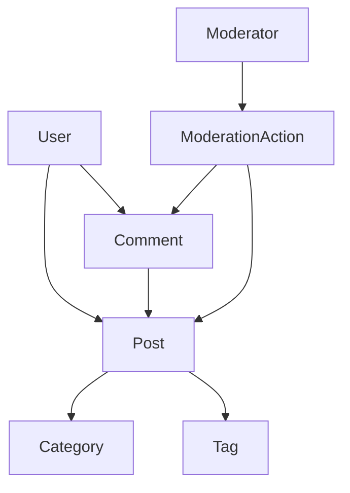

# Lesson 04: CMS Domain Roadmap

## Context

Auth-слой определяет, кто может работать с контентом. Теперь проектируем домен Blog/CMS так, чтобы он был масштабируемым и управляемым.

## Concept

Разбиваем CMS на отдельные модули с четкими границами ответственности:

- `posts` - жизненный цикл публикаций;
- `tags` / `categories` - классификация;
- `comments` - обсуждения;
- `moderation` - административные решения.

## Domain Model (Draft)



## Step-by-Step Implementation Plan

### Step 1 - Posts module

Вводим статусы:

- `draft`
- `published`
- `archived`

Пример DTO:

```ts
interface CreatePostDto {
  title: string;
  content: string;
  categoryId?: string;
  tagIds?: string[];
}
```

### Step 2 - Tags/Categories module

Что делаем:

- справочники для классификации постов;
- валидация связей при создании/обновлении поста.

### Step 3 - Comments module

Что делаем:

- комментарии только к доступным постам;
- базовые anti-abuse ограничения (добавим глубже в security track).

Пример guard-правила:

```ts
canComment(postStatus: PostStatus): boolean {
  return postStatus === 'published';
}
```

### Step 4 - Moderation module

Что делаем:

- endpoint'ы для модераторов/админов;
- действия: hide/unhide/delete/restore;
- аудит изменений (минимум: кто, что, когда).

### Step 5 - Cross-cutting rules

- ownership check для author-level операций;
- pagination + sorting + filtering;
- единый формат ошибок и валидации.

## Why This Matters

Хорошо спроектированный домен уменьшает хаос в бизнес-правилах и упрощает поддержку API.

## What To Remember

- Контроллеры тонкие, логика в сервисах.
- Права и ownership проверяем централизованно.
- Статусы сущностей - это часть бизнес-правил, а не только поле в БД.

## Verify

Сценарии:

1. Автор создает черновик, публикует, редактирует.
2. Чужой автор не может редактировать пост.
3. Комментарий не создается для `archived` поста.
4. Модератор скрывает комментарий.

## Homework

Предложи API-контракт для `GET /posts` с фильтрами:

- `status`
- `category`
- `tag`
- `page`
- `limit`
