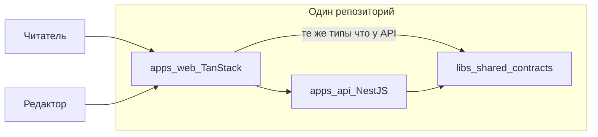

# История проекта: зачем мы это делаем

Этот файл — **не инструкция**, а разговор с наставником: почему мы строим блог/CMS именно так, какие проблемы решаем до того, как открывать урок с командами и файлами. Технические шаги, проверки и списки изменений — в [уроках](./lessons/) и [дорожной карте](./development-roadmap.md).

**Для тех, кто дописывает историю после урока:** формат глав и запреты зафиксированы в [правиле storytelling](../.cursor/rules/storytelling.mdc) — чтобы narrative не превращался снова в changelog по шагам.

## Как читать

| Документ                                                                              | Для чего                                                         |
| ------------------------------------------------------------------------------------- | ---------------------------------------------------------------- |
| **storytelling** (этот файл)                                                          | Погрузиться в контекст: сцена → проблема → что сделали в проекте |
| [learning-path.md](./learning-path.md)                                                | Увидеть порядок шагов по фазам                                   |
| [lessons/lesson-NNN-.md](./lessons/)                                                  | Сделать шаг руками                                               |
| [development-roadmap.md](./development-roadmap.md)                                    | Источник правды: что сделано и что дальше                        |
| [lesson-authoring-guide.md](./lesson-authoring-guide.md#documentation-sync-checklist) | Чеклист: куда вносить изменения после каждого шага               |

**Рекомендуемый порядок:** прочитайте раздел «Большая цель», затем **главу целиком** (I–XIV для пройденного трека). Перед конкретным уроком достаточно одной строки в таблице «Уроки этой главы» — так урок перестаёт ощущаться случайной настройкой. Текст главы — история и связи; команды и файлы — только в уроке.

### Оглавление глав

|                               | Глава                                                                             | Шаги         |
| ----------------------------- | --------------------------------------------------------------------------------- | ------------ |
| **Track 0 — фундамент**       |                                                                                   |              |
| I                             | [Один репозиторий — один договор](#глава-i-один-репозиторий--один-договор)        | 001–004      |
| II                            | [Два продукта, одни правила](#глава-ii-два-продукта-одни-правила)                 | 005–011      |
| III                           | [Общий язык до первой фичи](#глава-iii-общий-язык-до-первой-фичи)                 | 012–018      |
| IV                            | [Дисциплина, которая держит темп](#глава-iv-дисциплина-которая-держит-темп)       | 019–032      |
| **Track 1 — платформа API**   |                                                                                   |              |
| V                             | [API честно стартует](#глава-v-api-честно-стартует)                               | 033–036      |
| VI                            | [Ошибки — часть доверия](#глава-vi-ошибки--часть-доверия)                         | 037–042, 054 |
| VII                           | [Найти один запрос среди тысяч](#глава-vii-найти-один-запрос-среди-тысяч)         | 043–047      |
| VIII                          | [Система видна снаружи](#глава-viii-система-видна-снаружи)                        | 048–051      |
| IX                            | [Уважительная остановка](#глава-ix-уважительная-остановка)                        | 052–053      |
| **Track 2 — auth и identity** |                                                                                   |              |
| X                             | [Фундамент идентичности](#глава-x-фундамент-идентичности)                         | 057–062      |
| XI                            | [Вход и сессии](#глава-xi-вход-и-сессии)                                          | 063–073      |
| XII                           | [Жизненный цикл учётки](#глава-xii-жизненный-цикл-учётки)                         | 074–078      |
| XIII                          | [Кто что может делать](#глава-xiii-кто-что-может-делать)                          | 079–084      |
| XIV                           | [Проверяем доверие сквозным тестом](#глава-xiv-проверяем-доверие-сквозным-тестом) | 085–087      |

---

## Большая цель

Представьте редакцию, которая ведёт блог: читатель открывает статью в браузере, редактор — черновик в админке, а между ними — **API**, который хранит тексты, проверяет права и не отдаёт лишнего. Мы строим именно такую **fullstack систему (блог/CMS)**:

- **API** (NestJS) — данные, валидация, права, публикация.
- **Публичный сайт** (TanStack Start) — посты, SEO, быстрая загрузка.
- **Админка** (тот же стек) — черновики, превью, публикация.

Всё живёт в **одном репозитории** (монорепо): фронт, бэк и общие типы не расходятся по разным git-репозиториям. Это способ **договориться один раз** — о формате ошибок, health, DTO — и не ломать клиент при каждом изменении API.

Сейчас (после шага 087) у нас есть **мастерская** для разработки (Track 0), **взрослое API** с понятными ошибками и логами (Track 1) и **редакция с учётными записями**: люди регистрируются, входят, продлевают сессию через refresh, восстанавливают доступ, права разделены ролями, первый CMS-маршрут проверяет политику, форма access JWT зафиксирована в общих контрактах, а сквозная матрица auth e2e (вход, refresh, запрет CMS) зелёная. Дальше — аудит и операционные шаги Track 2, затем домен постов (Track 3). Точный список шагов — в [дорожной карте](./development-roadmap.md).

---

## Track 0: фундамент рабочего места

Track 0 — не «фичи продукта», а **цех**, в котором потом собирают продукт. Без него каждый следующий урок превращается в «а у меня не собирается» — и вы тратите силы не на логику блога, а на расхождения окружения.

---

## Глава I. Один репозиторий — один договор

**Шаги:** 001–004

### Сцена

У вас когда-нибудь было два «гаража» для одного проекта: бэкенд в одной папке со своим `node_modules`, фронт — в другом, у коллеги — третья версия Node? Вы правите API, а `npm test` с корня не запускается. Команда тратит день на «у меня работает», хотя задача — одна строка кода.

### Что болит, если этого нет

Разные lockfile, разные версии Node, нет единой точки сборки. Каждый новый человек в команде поднимает проект по-своему. CI и локальная машина живут в разных мирах.

### Намерение главы

Собрать **одну воспроизводимую мастерскую**: с корня ставятся зависимости, запускаются тесты и сборка; оркестратор знает проекты и умеет кэшировать повторяющуюся работу.

### Как это выглядело в нашем проекте

Мы начали с того, что превратили разрозненный Nest-проект в **семью пакетов под одним корнем** — один `package-lock.json`, одна команда `npm install`. Затем зафиксировали **версию Node и npm** для всех: это не прихоть, а договор такой же важный, как контракт API. «У меня на 20-й Node» и «у CI на 18-й» — классический источник красных пайплайнов без видимой причины в коде.

Дальше подключили **Nx** — не вместо npm, а поверх workspaces: единые цели `build`, `test`, `lint`, граф зависимостей и задел под кэш. И сразу настроили **target defaults** в `nx.json`, чтобы `lint` и `test` вели себя предсказуемо и кэш не ломался из-за разрозненных конфигов. К концу главы из корня можно честно сказать: «собери и проверь всё» — без памятки «сначала зайди в `apps/api`».

### Что стоит унести с собой

- Workspaces — это несколько `package.json` и **один** lockfile; дисциплина корня важнее, чем кажется, когда пакет один.
- Версия Node — **часть контракта проекта**, не личная настройка ноутбука.
- Nx **управляет** тем, что уже есть в монорепо; target — именованная задача проекта (`api:build`), не произвольный скрипт.

### Уроки этой главы

| Шаг | Суть                                         | Урок                                                              |
| --- | -------------------------------------------- | ----------------------------------------------------------------- |
| 001 | Корневые npm workspaces — одна семья пакетов | [lesson-001](./lessons/lesson-001-root-npm-workspaces.md)         |
| 002 | Политика Node/npm и LOCAL_SETUP              | [lesson-002](./lessons/lesson-002-local-setup-and-node-policy.md) |
| 003 | Инициализация Nx — оркестратор задач         | [lesson-003](./lessons/lesson-003-nx-init.md)                     |
| 004 | Target defaults и inference в nx.json        | [lesson-004](./lessons/lesson-004-nx-targets-and-inference.md)    |

---

## Глава II. Два продукта, одни правила

**Шаги:** 005–011

### Сцена

В здании открывают второй цех — витрину для гостей (сайт) — рядом с кухней (API). Если у цехов разные чертежи, разные «правила гигиены» и разные вывески на дверях, через месяц никто не понимает, где что лежит. Ревью превращается в спор о стиле, а не о логике.

### Что болит, если этого нет

Бэкенд в случайной папке, фронт «потом прикрутим отдельным репо», импорты через `../../../`, ESLint только на половине кода. Fullstack остается словом в резюме, а не в структуре репозитория.

### Намерение главы

Разместить **два приложения** (`api` и `web`) в привычной раскладке монорепо, выровнять TypeScript, линт и форматирование и дать **один вход** с корня для сборки и проверок.

### Как это выглядело в нашем проекте

Мы перенесли Nest в `apps/api` — не косметика, а место под соседа `apps/web` и библиотеки `libs/*` без переезда «на бегу». Общий tsconfig и алиасы `@blog/*` убрали лабиринт относительных импортов. Один ESLint на весь репозиторий и Prettier с EditorConfig сняли бесконечные диффы про пробелы: машина форматирует, люди обсуждают поведение.

Корневые `npm run build`, `test`, `lint` стали **фасадом над Nx** — и для вас, и для CI одна и та же дверь. Появился `apps/web` на TanStack Start: блог без UI — только API; учебный трек сразу fullstack. Отдельная цель `web:typecheck` дала быструю проверку типов без тяжёлой production-сборки — в CI и локально это экономит минуты и нервы.

### Что стоит унести с собой

- Структура папок — **договор команды**, не украшение.
- Path mapping связывает TypeScript и граф Nx — настраивайте согласованно.
- Разделяйте **typecheck** и **build**: разная скорость и разный смысл проверки.

### Уроки этой главы

| Шаг | Суть                                 | Урок                                                                 |
| --- | ------------------------------------ | -------------------------------------------------------------------- |
| 005 | Nest переехал в apps/api             | [lesson-005](./lessons/lesson-005-nest-apps-api-migration.md)        |
| 006 | Корневой tsconfig и paths            | [lesson-006](./lessons/lesson-006-root-tsconfig-base-and-paths.md)   |
| 007 | ESLint flat config в корне           | [lesson-007](./lessons/lesson-007-root-eslint-flat-config.md)        |
| 008 | Prettier и EditorConfig              | [lesson-008](./lessons/lesson-008-root-prettier-and-editorconfig.md) |
| 009 | Корневые скрипты через Nx            | [lesson-009](./lessons/lesson-009-root-scripts-via-nx.md)            |
| 010 | Приложение apps/web (TanStack Start) | [lesson-010](./lessons/lesson-010-apps-web-tanstack-start.md)        |
| 011 | Цель web:typecheck                   | [lesson-011](./lessons/lesson-011-web-typecheck-target.md)           |

---

## Глава III. Общий язык до первой фичи

**Шаги:** 012–018

### Сцена

Кухня и зал ресторана говорят на разных языках: официант приносит заказ «суп дня», а на кухне слышат «борщ». В разработке это выглядит так: фронт ждёт `{ status: 'ok' }`, API отдаёт `{ healthy: true }`, а CORS в браузере молча блокирует запрос — и кажется, что «бэкенд сломан».

### Что болит, если этого нет

Дублированные типы в api и web, расхождение после первого же рефакторинга, локальная БД «у кого как получилось», секреты в чате вместо шаблона env. Новый разработчик тратит день на угадывание переменных.

### Намерение главы

Завести **общий язык данных** (контракты), подключить оба приложения, поднять локальную инфраструктуру и описать запуск так, чтобы storytelling и уроки не заменяли runbook.

### Как это выглядело в нашем проекте

Появилась библиотека shared-contracts — место для типов и констант, которые обещают одну форму и API, и web. Сначала контракты подключили к API, затем к web: так проще поймать несовместимость на сборке, чем в проде ночью. Мы явно настроили CORS для dev — браузерная политика безопасности, не «баг Nest». Локальная Postgres в Docker Compose дала одинаковую БД у всех; шаблоны `.env.example` — договор «какие переменные нужны», без секретов в git. Корневой README и runbook для api/web закрыли вопрос «как поднять всё с нуля за пять минут».

### Что стоит унести с собой

- Контракт — код, который **обещает форму** обеим сторонам; копипаст в apps — путь к рассинхрону.
- CORS настраивают **осознанно по окружениям**, не `*` в проде.
- `.env.example` — документация, которую коммитят; `.env` — личное и секретное.

### Уроки этой главы

| Шаг | Суть                        | Урок                                                             |
| --- | --------------------------- | ---------------------------------------------------------------- |
| 012 | Библиотека shared-contracts | [lesson-012](./lessons/lesson-012-shared-contracts-lib.md)       |
| 013 | Контракты в API             | [lesson-013](./lessons/lesson-013-wire-shared-contracts-api.md)  |
| 014 | Контракты в web             | [lesson-014](./lessons/lesson-014-wire-shared-contracts-web.md)  |
| 015 | CORS и dev origins          | [lesson-015](./lessons/lesson-015-cors-and-dev-origins.md)       |
| 016 | PostgreSQL в Docker Compose | [lesson-016](./lessons/lesson-016-postgres-compose-local-dev.md) |
| 017 | Файлы .env.example          | [lesson-017](./lessons/lesson-017-env-example-files.md)          |
| 018 | README и runbook            | [lesson-018](./lessons/lesson-018-root-readme-runbook.md)        |

---

## Глава IV. Дисциплина, которая держит темп

**Шаги:** 019–032

### Сцена

Перед открытием спектакля делают **генеральную репетицию**: свет, звук, декорации — по чеклисту, а не «вроде всё включилось». В софте репетиция — это CI, кэш, правила документации и явный список «фундамент готов». Иначе команда из двух человек растёт до пяти — и каждый пушит по-своему.

### Что болит, если этого нет

«У меня зелёное» без общего арбитра; CI, который гоняет весь монорепо на каждый коммит; 300 уроков без соглашений об именах; решения «почему не Next» теряются в чате; секреты в логах и в git.

### Намерение главы

Закрепить **общий арбитр качества** (CI + Nx cache + affected), дисциплину документации и релизов, память о решениях (ADR) и честный **Definition of Done** для Track 0.

### Как это выглядело в нашем проекте

В GitHub Actions завели **те же проверки**, что локально — CI как скучное эхо, не отдельная магия. Кэш Nx в CI и **affected** сократили время и деньги: с ростом репозитория полный прогон на каждый коммит становится роскошью. Опционально описали pre-commit — дешевле поймать опечатку до push. Зафиксировали **конвенции уроков** (один шаг roadmap = один `lesson-NNN`), заготовку **релиза и changelog**, аккуратный `**.gitignore`\*\*, рекомендации VS Code.

**ADR-000** объясняет, почему Nx и TanStack Start — память команды на годы. Черновик **threat model** напоминает: безопасность начинается с «что может пойти не так», а не с «добавим JWT в пятницу». **Smoke health** отделяет «процесс запустился» от «процесс отвечает». **Чеклист приёмки Track 0** — мост между обучением и готовностью к фичам. Резервные шаги **031–032** (матрица CI, процесс ADR для отклонений) — запас прочности: отклонение от плана **оформляется**, а не прячется в коммите.

### Что стоит унести с собой

- CI повторяет локальные Nx-команды; pre-commit — усилитель, не замена.
- Affected связывает git diff с минимальным набором проверок.
- ADR и threat model можно начинать простым markdown и уточнять позже.

### Уроки этой главы

| Шаг | Суть                                | Урок                                                                       |
| --- | ----------------------------------- | -------------------------------------------------------------------------- |
| 019 | Базовый CI (GitHub Actions)         | [lesson-019](./lessons/lesson-019-ci-pipeline-baseline.md)                 |
| 020 | Кэш Nx в CI                         | [lesson-020](./lessons/lesson-020-nx-cache-in-ci.md)                       |
| 021 | Nx affected в CI                    | [lesson-021](./lessons/lesson-021-nx-affected-flow-in-ci.md)               |
| 022 | Husky и lint-staged (опционально)   | [lesson-022](./lessons/lesson-022-optional-husky-lint-staged-policy.md)    |
| 023 | Конвенции папки уроков              | [lesson-023](./lessons/lesson-023-lessons-folder-structure-conventions.md) |
| 024 | Политика релизов и changelog        | [lesson-024](./lessons/lesson-024-release-stub-and-changelog-policy.md)    |
| 025 | Нормализация .gitignore             | [lesson-025](./lessons/lesson-025-normalize-gitignore.md)                  |
| 026 | Рекомендации VS Code (опционально)  | [lesson-026](./lessons/lesson-026-optional-vscode-recommendations.md)      |
| 027 | ADR-000: Nx и TanStack Start        | [lesson-027](./lessons/lesson-027-adr-000-nx-tanstack-start.md)            |
| 028 | Заготовка threat model              | [lesson-028](./lessons/lesson-028-threat-model-stub.md)                    |
| 029 | Smoke-скрипт health                 | [lesson-029](./lessons/lesson-029-health-smoke-script.md)                  |
| 030 | Чеклист приёмки Track 0             | [lesson-030](./lessons/lesson-030-track-0-acceptance-checklist.md)         |
| 031 | Улучшения CI matrix (резерв)        | [lesson-031](./lessons/lesson-031-ci-matrix-improvements.md)               |
| 032 | Процесс ADR для отклонений (резерв) | [lesson-032](./lessons/lesson-032-adr-process-deviations.md)               |

**Итог Track 0:** монорепо с api + web, общими контрактами, локальной БД, CI и документацией. Можно строить платформенное поведение API, не отвлекаясь на «где лежит проект».

---

## Track 1: платформа API

Track 1 — **как API ведёт себя как сервис**, которому доверяют ops и который не стыдно показать фронту: честный старт, понятные ошибки, прослеживаемость, метрики, версии URL, корректная остановка. На этом лягут auth, посты и модерация.

---

## Глава V. API честно стартует

**Шаги:** 033–036

### Сцена

Врач не начинает приём, пока не убедится, что пациент в сознании и приборы включены. API, который стартует с «тихим» неверным портом или CORS и падает на первом реальном запросе в три ночи — тот же сюжет: проблема обнаружена слишком поздно.

### Что болит, если этого нет

Неверный `.env` всплывает в середине сценария; оркестратор шлёт трафик на инстанс, который ещё не подключился к БД; health отдаёт «свободный JSON», который никто не парсит одинаково.

### Намерение главы

**Fail-fast** при старте, разделить «процесс жив» и «готов принимать трафик», зафиксировать форму health в контрактах.

### Как это выглядело в нашем проекте

При запуске API **читает и проверяет** переменные окружения через Zod — неверный конфиг роняет процесс сразу, а не в середине оплаты. Появились **liveness** (`/health`) и **readiness** (`/health/ready`): оркестратор отличает «упал процесс» от «ещё не готов». Форма ответа health переехала в **shared-contracts** — и API, и клиенты читают один словарь, даже для «служебного» эндпоинта.

### Что стоит унести с собой

- Конфиг — схема + валидация, синхронная с `.env.example`.
- Liveness — про процесс; readiness — про зависимости и трафик.

### Уроки этой главы

| Шаг | Суть                               | Урок                                                                 |
| --- | ---------------------------------- | -------------------------------------------------------------------- |
| 033 | ConfigModule и валидация env (Zod) | [lesson-033](./lessons/lesson-033-nest-config-and-env-validation.md) |
| 034 | Liveness /health                   | [lesson-034](./lessons/lesson-034-terminus-health-liveness.md)       |
| 035 | Readiness /health/ready            | [lesson-035](./lessons/lesson-035-readiness-probe-dependencies.md)   |
| 036 | DTO health в shared-contracts      | [lesson-036](./lessons/lesson-036-health-response-dtos.md)           |

---

## Глава VI. Ошибки — часть доверия

**Шаги:** 037–042, 054

### Сцена

Гость в ресторане спрашивает, почему нет блюда. Хороший официант объясняет понятно; плохой — зачитывает внутренний складской отчёт с артикулами. API без единого формата ошибок заставляет фронт гадать; утечка stack trace в JSON — как складской отчёт на столе гостя.

### Что болит, если этого нет

Каждый контроллер со своим `{ error: string }`; валидация вручную в каждом методе; 5xx с текстом «connection string …»; фронт и тесты не могут стабильно парсить ответ.

### Намерение главы

Сделать ошибку **продуктовым интерфейсом**: один конверт, глобальный filter, автоматическая валидация DTO, стандарт Problem Details, безопасные 5xx.

### Как это выглядело в нашем проекте

В контрактах описали **единый конверт ошибки**. Глобальный exception filter переводит любое исключение в предсказуемый HTTP-статус и тело. ValidationPipe с whitelist и transform закрывает дыры «лишних полей» в body. Эталонный ресурс **examples** показал, как писать DTO в этом проекте. Ошибки выровняли под стандарт Problem Details — один media type для всего API. Для неизвестных 5xx клиент видит нейтральную фразу, полная картина остаётся в логах сервера. Позже закрепили этот договор автотестами: wire-формат ошибок не «плывёт» между релизами, а health probes по-прежнему не смешиваются с problem+json.

### Что стоит унести с собой

- Ошибка API — интерфейс, как успешный JSON.
- 4xx можно объяснять пользователю; 5xx для клиента — одна безопасная формулировка.

### Уроки этой главы

| Шаг | Суть                           | Урок                                                             |
| --- | ------------------------------ | ---------------------------------------------------------------- |
| 037 | Типы конверта ошибок API       | [lesson-037](./lessons/lesson-037-api-error-envelope-types.md)   |
| 038 | Глобальный exception filter    | [lesson-038](./lessons/lesson-038-global-exception-filter.md)    |
| 039 | Глобальный ValidationPipe      | [lesson-039](./lessons/lesson-039-global-validation-pipe.md)     |
| 040 | Конвенции DTO и пример ресурса | [lesson-040](./lessons/lesson-040-dto-validation-conventions.md) |
| 041 | Problem Details (problem+json) | [lesson-041](./lessons/lesson-041-problem-details-alignment.md)  |
| 042 | Безопасные unknown-ошибки      | [lesson-042](./lessons/lesson-042-safe-unknown-errors.md)        |
| 054 | Contract-тесты формата ошибок  | [lesson-054](./lessons/lesson-054-error-json-contract-tests.md)  |

---

## Глава VII. Найти один запрос среди тысяч

**Шаги:** 043–047

### Сцена

Пользователь пишет в поддержку: «Оплата не прошла в 14:03». В логах — тысячи строк. Без **номера заказа** вы ищете иголку вслепую. В распределённой системе этот номер — request id и correlation id; без них инцидент растягивается на часы.

### Что болит, если этого нет

Нельзя связать ответ API, лог и трейс; в логах оказываются пароли и токены; access-log дублирует или размазывает поля; поддержка не может процитировать id из ответа.

### Намерение главы

Проследить **один HTTP-вызов** от заголовка ответа до строки в агрегаторе логов — и не утекать секретами в JSON.

### Как это выглядело в нашем проекте

Каждый запрос получил **request id** (принимаем валидный от клиента или генерируем), храним в контексте запроса, отдаём в `X-Request-Id` и в `instance` problem+json. Логи стали **структурированным JSON** (pino): один уровень — одна строка, при наличии контекста — тот же request id. **Access-log** на каждый HTTP-запрос дополняет картину трафика без включения тяжёлого autoLogging. **Correlation id** связывает цепочку вызовов; один HTTP-вызов по-прежнему идентифицируется request id. **Redaction** вычищает пароли, токены, Authorization и Cookie до записи — страховка перед Track 2 (auth).

### Что стоит унести с собой

- Request id — один звонок; correlation id — цепочка звонков.
- Access-log и секреты в объекте лога — разные риски; redact закрывает второй.

### Уроки этой главы

| Шаг | Суть                          | Урок                                                              |
| --- | ----------------------------- | ----------------------------------------------------------------- |
| 043 | Request ID и контекст запроса | [lesson-043](./lessons/lesson-043-request-id-middleware.md)       |
| 044 | Структурированное логирование | [lesson-044](./lessons/lesson-044-structured-logging.md)          |
| 045 | Request logging interceptor   | [lesson-045](./lessons/lesson-045-request-logging-interceptor.md) |
| 046 | Correlation ID                | [lesson-046](./lessons/lesson-046-correlation-id.md)              |
| 047 | Redaction в логах             | [lesson-047](./lessons/lesson-047-log-redaction.md)               |

---

## Глава VIII. Система видна снаружи

**Шаги:** 048–051

### Сцена

У самолёта есть приборная панель и адресные таблички на дверях: пилот видит давление, диспетчер — номер рейса. Ops смотрит на метрики и health; другие сервисы продолжают **тот же trace**, если прислали заголовок. Прикладные маршруты («меню ресторана») не смешивают с техническими («аварийный выход»).

### Что болит, если этого нет

Каждый запрос — изолированный остров в трейсинге; нет точки для Prometheus; продуктовые URL и `/health` живут в одной куче; клиенты не знают версию API в пути.

### Намерение главы

Подготовить **проводку наблюдаемости** (OTel, W3C propagation), отдать **метрики**, отделить **версионированный API** от ops-эндпоинтов на корне.

### Как это выглядело в нашем проекте

Зарегистрировали OpenTelemetry tracer provider без экспорта в dev/CI — проводка до collector'а. На входящем HTTP читаем заголовок traceparent и поднимаем server span в том же trace на весь Nest pipeline. Эндпоинт metrics отдаёт Prometheus text exposition, отдельно от JSON health. Прикладной API переехал под префикс `/api/v1`; health и metrics остались на корне для Kubernetes и scraper'а — «технические двери» не смешиваются с меню для клиентов.

### Что стоит унести с собой

- Tracing можно включать поэтапно: сначала propagation, потом export.
- Health и metrics — разные контракты и аудитория, чем REST ресурсы CMS.

### Уроки этой главы

| Шаг | Суть                               | Урок                                                            |
| --- | ---------------------------------- | --------------------------------------------------------------- |
| 048 | OpenTelemetry (noop wiring)        | [lesson-048](./lessons/lesson-048-opentelemetry-noop.md)        |
| 049 | W3C trace context на входящем HTTP | [lesson-049](./lessons/lesson-049-trace-context-propagation.md) |
| 050 | Prometheus /metrics stub           | [lesson-050](./lessons/lesson-050-metrics-endpoint-stub.md)     |
| 051 | /api/v1 + ops на корне             | [lesson-051](./lessons/lesson-051-api-prefix-and-versioning.md) |

---

## Глава IX. Уважительная остановка

**Шаги:** 052–053

### Сцена

Ресторан закрывается не обесточиванием зала в момент заказа: сначала дослуживают гостей за столиками, потом гасят свет. Kubernetes при деплое шлёт **SIGTERM** — API должен перестать принимать новых, дождаться текущих и освободить соединения с БД.

### Что болит, если этого нет

Обрыв запросов без ответа; запись в закрытый сокет; pool Postgres остаётся висеть; «зависший» handler держит worker минутами.

### Намерение главы

Корректно завершать процесс и **ограничивать длительность** обработки HTTP с понятным ответом клиенту.

### Как это выглядело в нашем проекте

Включили shutdown hooks: по SIGTERM API пишет structured log, закрывает pool, завершает процесс; smoke проверяет сценарий «запуск → health → SIGTERM → exit 0». **Request timeout** обрывает слишком долгие handler'ы с 408 и кодом `REQUEST_TIMEOUT` в problem+json; обрыв клиента отменяет работу. При shutdown новые запросы получают **503**, in-flight запросы **дренируются** в пределах grace period, затем закрытие приложения.

### Что стоит унести с собой

- Graceful shutdown — часть контракта с оркестратором, не «nice to have».
- Timeout interceptor и logging — порядок регистрации имеет значение.

### Уроки этой главы

| Шаг | Суть                                     | Урок                                                          |
| --- | ---------------------------------------- | ------------------------------------------------------------- |
| 052 | Graceful shutdown (SIGTERM)              | [lesson-052](./lessons/lesson-052-graceful-shutdown-hooks.md) |
| 053 | Request timeout / abort + shutdown grace | [lesson-053](./lessons/lesson-053-request-timeout-abort.md)   |

**Итог Track 1:** API стартует с проверенным конфигом, отчитывается о здоровье, отвечает на сбои предсказуемо и безопасно (wire-формат ошибок зафиксирован contract-тестами), помечает запросы, пишет структурированные логи, поддерживает tracing и metrics stub, обслуживает версионированный API на `/api/v1`, корректно останавливается.

---

## Приёмка Track 1

**Шаги:** 055–056

### Как это выглядело в нашем проекте

Track 1 длинный: десятки механизмов, каждый со своим уроком. **Чеклист приёмки** (055) — мост между «мы прошли уроки» и «можно строить auth»: одна страница с командами (`api:test`, `shutdown:smoke`, curl health/metrics) и ссылками на уроки 033–054. Шаг **056** закрыл observability follow-ups: OTLP по желанию, `traceId` в логах, HTTP histogram в Prometheus, тихие ops-маршруты в access-log — зафиксировано в [ADR-002](./adr/002-platform-observability.md). Track 1 завершён; дальше auth.

### Уроки

| Шаг | Суть                               | Урок                                                                    |
| --- | ---------------------------------- | ----------------------------------------------------------------------- |
| 055 | Чеклист приёмки Track 1            | [lesson-055](./lessons/lesson-055-track-1-acceptance-checklist.md)      |
| 056 | Observability follow-ups (reserve) | [lesson-056](./lessons/lesson-056-platform-observability-follow-ups.md) |

---

## Track 2: auth и identity

Track 1 научил API **вести себя как сервис**: честный старт, понятные ошибки, прослеживаемость. Track 2 отвечает на вопрос редакции: **кто вы** и **что вам можно**. Это четыре главы одной дуги — от памяти в Postgres до первого CMS-маршрута, где права уже имеют смысл.

---

## Глава X. Фундамент идентичности

**Шаги:** 057–062

### Сцена

Редакция не может публиковать от имени «кого угодно». Но прежде чем спорить о ролях и JWT, нужна **память**: кто такой пользователь, где лежит пароль, как схема БД меняется без хаоса. Платформа API уже умеет ошибки и health; без слоя данных auth превращается в сырой SQL в каждом контроллере.

### Что болит, если этого нет

Схема живёт в головах; `synchronize: true` ломает прод; миграции «когда-нибудь»; пароли хэшируются по-разному в разных местах; тесты и readiness дерутся за одно соединение с БД без договора.

### Намерение главы

Заложить **предсказуемый фундамент**: ORM без автосхемы, один URL базы в validated env, рабочий migration workflow, сущность пользователя и единая точка для хэширования паролей.

### Как это сложилось у нас

Мы подключили Postgres через TypeORM так, чтобы Nest **не переписывал** схему при старте — только миграции. Один канонический URL базы проходит ту же Zod-валидацию, что и остальной конфиг: неверная строка подключения падает на старте, а не в середине регистрации.

Дальше — дисциплина миграций: CLI на том же DataSource, что и приложение, baseline без доменных таблиц, затем первая настоящая таблица `users` с уникальным email и колонкой под хэш пароля. Пароли не храним в открытом виде: один сервис на Argon2id отвечает за hash и verify, его можно тестировать без Postgres. Над ним — тонкий сервис пользователя: создать запись и найти по email — задел для регистрации и входа в следующей главе.

### Связь с прошлым

- **Fail-fast env** (глава V) — тот же принцип для `DATABASE_URL`.
- **Readiness** (глава V) — отдельный pool для probe, доменная БД не смешивается с «жив ли процесс».
- **Локальный Postgres** (глава III) — та же БД, к которой теперь подключается API по договору.

### Что стоит унести с собой

- `synchronize: false` — не лень, а граница между dev и prod.
- Миграции — часть поставки, как код.
- Хэш пароля — одна ответственность, не фрагмент в контроллере.

### Уроки этой главы

| Шаг | Суть                              | Урок                                                                         |
| --- | --------------------------------- | ---------------------------------------------------------------------------- |
| 057 | Postgres + TypeORM bootstrap      | [lesson-057](./lessons/lesson-057-database-module-postgres-orm-bootstrap.md) |
| 058 | DATABASE_URL в validated env      | [lesson-058](./lessons/lesson-058-datasource-config-database-url.md)         |
| 059 | Migration workflow + baseline     | [lesson-059](./lessons/lesson-059-migration-workflow-baseline-schema.md)     |
| 060 | Сущность User и таблица users     | [lesson-060](./lessons/lesson-060-user-entity-indexes.md)                    |
| 061 | Password hasher (Argon2id)        | [lesson-061](./lessons/lesson-061-password-hasher-service.md)                |
| 062 | UserService: create / findByEmail | [lesson-062](./lessons/lesson-062-user-service-create-find-by-email.md)      |

---

## Глава XI. Вход и сессии

**Шаги:** 063–073

### Сцена

Редактор приходит утром, вводит email и пароль — и ожидает, что система **узнает его** и не выбросит через пять минут. Гость в ресторане получает браслет на вечер, а не новый паспорт на каждый заказ. В API это пара: короткий access-токен для запросов и долгий refresh для продления сессии без повторного пароля.

### Что болит, если этого нет

Регистрация и логин в каждом контроллере по-своему; дубликат email даёт 500 вместо понятного отказа; JWT без guard'а; refresh без ротации — украли токен, пользуются месяцами; logout «для вида»; клиент не понимает, истёк access или сессия мёртва.

### Намерение главы

Построить **доверенный вход**: register и login через общие контракты, access JWT, refresh с ротацией и отзывом, явные TTL, защита от перебора пароля — в духе Track 1 (нейтральные ошибки, без enumeration).

### Как это сложилось у нас

Сначала — регистрация и логин как продуктовые маршруты: ответы из shared-contracts, домен в сервисах, а не в контроллере. Email нормализуем один раз; дубликат и гонка уникальности превращаются в **409** в том же Problem Details, что настроили в главе VI — клиент не видит внутренностей Postgres.

Логин намеренно **не различает** «нет такого email» и «неверный пароль» — одна фраза и 401, чтобы не помогать подбору аккаунтов. Access-токен короткий; его проверяет guard, а контроллеры читают текущего пользователя через декоратор, не копаясь в request вручную.

Refresh — отдельная история: opaque токен в БД только как хэш, при обновлении старый помечается заменённым, при подозрительном reuse отзывается **вся цепочка** сессии. Logout идемпотентен — не раскрывает, был ли токен. TTL access и refresh задаём из env и фиксируем в документации, чтобы ops и разработка говорили на одном языке. После серии неудачных попыток входа — временная блокировка по email (429), без подсказок злоумышленнику.

### Связь с прошлым

- **Problem Details** (глава VI) — те же конверты для 401, 409, 429; позже contract-тесты (054) страхуют wire-формат.
- **Redaction в логах** (глава VII) — задел под пароли и токены в логах при auth.
- **Request id** (глава VII) — тот же идентификатор в `instance` ошибки для поддержки.
- **UserService и hasher** (глава X) — логин и register не дублируют SQL.

### Что стоит унести с собой

- Ошибка входа — продуктовый интерфейс, не отладочный дамп.
- Refresh rotation — цена утечки долгой сессии.
- Lockout и нейтральные ответы — одна политика доверия.

### Уроки этой главы

| Шаг | Суть                          | Урок                                                                   |
| --- | ----------------------------- | ---------------------------------------------------------------------- |
| 063 | POST /auth/register + DTO     | [lesson-063](./lessons/lesson-063-auth-register-dto.md)                |
| 064 | Unique email → 409 CONFLICT   | [lesson-064](./lessons/lesson-064-unique-email-friendly-conflict.md)   |
| 065 | POST /auth/login              | [lesson-065](./lessons/lesson-065-auth-login.md)                       |
| 066 | JWT access sign/verify        | [lesson-066](./lessons/lesson-066-jwt-access-token-service.md)         |
| 067 | JwtStrategy + guard + /me     | [lesson-067](./lessons/lesson-067-jwt-strategy-auth-guard.md)          |
| 068 | @CurrentUser()                | [lesson-068](./lessons/lesson-068-current-user-decorator.md)           |
| 069 | Refresh token persistence     | [lesson-069](./lessons/lesson-069-refresh-token-entity-persistence.md) |
| 070 | POST /auth/refresh + rotation | [lesson-070](./lessons/lesson-070-auth-refresh-rotation.md)            |
| 071 | POST /auth/logout             | [lesson-071](./lessons/lesson-071-auth-logout-revoke-refresh.md)       |
| 072 | Refresh reuse → revoke family | [lesson-072](./lessons/lesson-072-auth-refresh-reuse-detection.md)     |
| 073 | Token TTL в env               | [lesson-073](./lessons/lesson-073-token-ttl-configuration.md)          |

---

## Глава XII. Жизненный цикл учётки

**Шаги:** 074–078

### Сцена

Новый автор регистрируется, но почта ещё не подтверждена. Коллега забыл пароль в пятницу вечером. Хорошая редакция не кричит «аккаунта нет» вслух в open space и не шлёт reset-ссылку только реальным пользователям с разными ответами — иначе злоумышленник **перебирает** email по реакции API.

### Что болит, если этого нет

Верификация и reset — разовые скрипты; токены в открытом виде в БД; сброс пароля не рвёт старые сессии; ответ «пользователь не найден» на reset; брутфорс login без тормоза.

### Намерение главы

Закрыть **жизненный цикл учётки** после входа: ограничить перебор пароля, подтвердить email, безопасно сбросить пароль — везде с anti-enumeration и отзывом сессий при смене секрета.

### Как это сложилось у нас

Lockout дополняет login из главы XI: тот же normalized email, тот же принцип «не подсказывать лишнего», но после порога — пауза 429. Верификация почты и сброс пароля устроены как **одноразовые opaque-токены** в БД (только хэш), с TTL и consume — та же логика, что refresh, но для других сценариев.

Регистрация выдаёт токен подтверждения (пока без SMTP в ответе — учебный контракт). Подтверждение почты и сброс пароля при неверном токене отвечают нейтрально, как login. Запрос сброса всегда звучит одинаково; смена пароля отзывает **все** активные refresh — украденная сессия не переживает новый пароль.

### Связь с прошлым

- **Сессии** (глава XI) — reset рвёт refresh-цепочки.
- **Хэшер** (глава X) — новый пароль через тот же Argon2id.
- **Нейтральные 401** (глава XI) — тот же тон для «токен не подошёл».

### Что стоит унести с собой

- Anti-enumeration — не фича reset, а политика всего auth.
- Смена пароля = пересмотр всех сессий.
- Opaque + hash в БД — один паттерн для refresh, verify и reset.

### Уроки этой главы

| Шаг | Суть                            | Урок                                                                 |
| --- | ------------------------------- | -------------------------------------------------------------------- |
| 074 | Login lockout → 429             | [lesson-074](./lessons/lesson-074-login-brute-force-lockout.md)      |
| 075 | Модель токена верификации email | [lesson-075](./lessons/lesson-075-email-verification-token-model.md) |
| 076 | POST /auth/verify-email         | [lesson-076](./lessons/lesson-076-auth-verify-email.md)              |
| 077 | Запрос сброса пароля            | [lesson-077](./lessons/lesson-077-password-reset-request-flow.md)    |
| 078 | Завершение сброса пароля        | [lesson-078](./lessons/lesson-078-password-reset-completion.md)      |

---

## Глава XIII. Кто что может делать

**Шаги:** 079–084

### Сцена

В редакции не все равны: главный редактор, автор, стажёр с доступом только на чтение. JWT говорит «это пользователь 42», но **не заменяет** оргструктуру. Первый настоящий CMS-маршрут — не «ещё один GET», а проверка: система понимает роли и права до того, как появятся посты и черновики.

### Что болит, если этого нет

Права захардкожены в `if (userId === 1)`; роли в JWT раздуваются и устаревают; guard дублируется в каждом контроллере; seed ролей вручную в SQL перед демо.

### Намерение главы

Разделить **аутентификацию** (кто вы) и **авторизацию** (что можно): схема RBAC в БД, seed справочников, guards по роли и по permission, образцовый CMS-маршрут как демо политики.

### Как это сложилось у нас

Сначала — таблицы ролей, прав и связей: пользователь может иметь несколько ролей, роль — набор permissions. Код знает slug'и ролей и ключи вроде «читать посты» / «писать посты», но источник правды — БД, не захардкоженный массив в JWT.

Идемпотентный seed наполняет справочник ролей, затем permissions и матрицу «кому что можно» — admin и editor шире, viewer только читает. Coarse guard по роли и fine-grained по permission читают права из БД по `sub` из токена; отказ — 403 в том же Problem Details.

Первый продуктовый CMS-маршрут — пустой список постов, но с настоящей проверкой: без входа — 401, без права читать — 403, с правом — 200. Учебные probe-маршруты остаются для изолированной проверки guards; смысл главы — **политика**, а не CRUD.

Форму access-токена мы вынесли в общий пакет контрактов: в JWT по-прежнему только «кто вы» (`sub`), без ролей и permissions — и api, и будущий web читают один и тот же тип, не копируя его из исходников бэкенда.

### Связь с прошлым

- **JWT только с sub** (глава XI) — роли не раздуваем в токен, права свежие из БД.
- **Версионированный API** (глава VIII) — CMS живёт под `/api/v1` рядом с auth.
- **403 vs 401** — не путать «не представились» и «представились, но нельзя».

### Что стоит унести с собой

- Роль — ярлык; permission — действие. Оба нужны на разных уровнях.
- Первый CMS-маршрут — экзамен на RBAC, не на контент.
- Seed — воспроизводимая репетиция, не ручной SQL перед демо.

### Уроки этой главы

| Шаг | Суть                                | Урок                                                               |
| --- | ----------------------------------- | ------------------------------------------------------------------ |
| 079 | Схема roles / permissions           | [lesson-079](./lessons/lesson-079-roles-permissions-schema.md)     |
| 080 | Seed ролей по умолчанию             | [lesson-080](./lessons/lesson-080-seed-default-roles.md)           |
| 081 | RolesGuard + @Roles()               | [lesson-081](./lessons/lesson-081-roles-guard.md)                  |
| 082 | PermissionsGuard + seed permissions | [lesson-082](./lessons/lesson-082-permissions-guard.md)            |
| 083 | Sample CMS route + RBAC             | [lesson-083](./lessons/lesson-083-sample-cms-route-rbac.md)        |
| 084 | JWT payload в shared-contracts      | [lesson-084](./lessons/lesson-084-jwt-payload-shared-contracts.md) |

**Итог Track 2 (057–084):** у API есть память о пользователях, предсказуемый вход и сессии, жизненный цикл учётки и слой прав — контракт JWT в shared-contracts закрыт; сквозные auth e2e продолжаются в главе XIV.

---

## Глава XIV. Проверяем доверие сквозным тестом

**Шаги:** 085–087

### Сцена

Редакция наняла ночного сторожа: он не читает каждый урок по отдельности, а **проходит маршрут целиком** — зарегистрировался, вошёл, показал пропуск на проходной. Если register «создал» одного человека, а login ищет другого, сторож это поймает раньше, чем редактор утром.

### Что болит, если этого нет

Изолированные e2e с подменой пользователя дают зелёный CI, но **не склеивают** register и login: hash, id и JWT могут разъехаться между файлами. Ошибка всплывает только в ручном curl или в проде.

### Намерение главы

Закрепить **сквозную матрицу auth e2e**: happy path входа, ротация refresh, запреты RBAC — без Postgres в CI, с общим состоянием в рамках одного сценария.

### Как это сложилось у нас

Первый шаг — register → login → «кто я» в одном прогоне: in-memory хранилище вместо статического fake user, реальный Argon2 и настоящий access JWT, без подмены hasher'а. Отдельные e2e на validation и 401 остаются быстрыми; flow-тест — страховка, что Track 2 auth **склеен**.

Второй шаг той же главы — register → login → refresh: общий in-memory store для opaque refresh, ротация меняет сырой токен, повтор уже отозванного refresh даёт тот же нейтральный отказ и рвёт всё семейство — как в политике reuse, но проверено не на моках, а на связке маршрутов.

Третий шаг закрывает авторизацию на CMS: после register и login access JWT несёт `sub` реального пользователя, guard запрашивает права по этому id — без ролей в БД список постов отвечает тем же запретом, что и в продуктовой политике; «write без read» не обходит read-only маршрут. In-memory permissions в тестах не подменяют Postgres в CI, но ловят рассинхрон id между register и RBAC lookup — иначе Track 3 унаследовал бы хрупкий контракт.

### Связь с прошлым

- **Register и login** (главы X–XI) — flow проверяет, что пароль из register читается login.
- **JWT и /me** (глава XI) — access из login принимается guard'ом.
- **RBAC** (глава XIII) — в 087 тот же подход на 403.

### Что стоит унести с собой

- Изолированный e2e и flow e2e **дополняют** друг друга.
- Stateful store в тестах — цена сквозной уверенности без Docker Postgres.
- Happy path — фундамент; негативные кейсы уже живут в отдельных файлах.

### Уроки этой главы

| Шаг | Суть                       | Урок                                                                 |
| --- | -------------------------- | -------------------------------------------------------------------- |
| 085 | E2e register → login → /me | [lesson-085](./lessons/lesson-085-auth-register-login-e2e-flow.md)   |
| 086 | E2e refresh rotation       | [lesson-086](./lessons/lesson-086-auth-refresh-rotation-e2e-flow.md) |
| 087 | E2e RBAC forbidden         | [lesson-087](./lessons/lesson-087-auth-rbac-forbidden-e2e-flow.md)   |

---

## Сквозные принципы

1. **Один репозиторий — один договор.** Workspaces, Nx и shared-contracts держат api и web в синхроне; споры решаются типами, а не перепиской в чате.
2. **Fail-fast.** Неверный env или контракт должен «щёлкнуть» на сборке или старте, а не в проде ночью.
3. **Контракты в libs, не копипаст.** Health, ошибки, будущие DTO постов — общий язык.
4. **Один шаг — одна идея в уроке; одна глава — одно намерение в storytelling.** Так проще учиться и ревьюить.
5. **Проверяйте поведение явно.** Где нет unit-теста — smoke, CI или чеклист; «вроде работает» не считается. Изменения `apps/api/src` без `*.spec.ts` в том же коммите блокирует pre-commit (tests-first).
6. **Безопасность ошибок и логов по умолчанию.** Клиент не видит внутренности 5xx; агрегатор логов не должен видеть пароли.
7. **Документация — часть поставки.** Урок, эта история, roadmap и README отвечают на разные вопросы и дополняют друг друга.
8. **Storytelling — история, не changelog.** В тексте глав — сцены, связи и арки; перечень шагов с именами сервисов и HTTP-кодами остаётся в уроках и roadmap. Таблица в конце главы — только индекс уроков.

---

## Где мы сейчас

Представьте редакцию блога: **читатель** ещё ждёт витрину, **редактор** — рабочий стол, между ними — API, которому уже можно доверять.

**Track 0 (001–032)** — мастерская готова: один репозиторий, api и web, общие контракты, локальная БД, CI и договорённости о документации. Сюда не нужно возвращаться за каждой фичей — только если ломается окружение.

**Track 1 (033–056)** — API ведёт себя как взрослый сервис: конфиг проверяется при старте, health и метрики отделены от продуктовых URL, ошибки в одном формате (и закреплены тестами), запросы прослеживаются в логах, процесс корректно останавливается.

**Track 2 (057–087)** — у редакции появилась **идентичность**: пользователи в Postgres, регистрация и вход, сессии с refresh и ротацией (включая reuse в flow e2e), подтверждение почты и сброс пароля без «подсказок» злоумышленнику, роли и права в БД, первый CMS-маршрут проверяет «можно ли читать посты», access JWT описан в shared-contracts, сквозная матрица auth e2e (вход, refresh, запрет CMS) зелёная.

**Ещё не в продуктовой истории:** сами посты, CRUD, публичный сайт и SEO — это Tracks 3–4 (с **116+** в [дорожной карте](./development-roadmap.md)); в Track 2 остаются аудит, acceptance checklist и резервные шаги до **102**.

---

## Что дальше

Следующий шаг Track 2 — **088**: таблица security audit log. Глава XIV (auth e2e матрица) закрыта; домен постов (Track 3) можно начинать параллельно по roadmap.

Когда появятся новые треки, добавляйте **новую главу** (сцена → намерение → narrative → таблица уроков), а не дописывайте в конец одной главы список «шаг 057 — … 058 — …». Обновляйте narrative **аркой** (2–4 предложения) и одну строку в таблице; «Где мы сейчас» и «Что дальше» — коротким checkpoint, не копией roadmap.

**Впереди по сюжету (см. roadmap):** домен постов и админка на API (Track 3), публичный TanStack Start для читателя (Track 4).

---

## Мини-глоссарий

| Термин               | Простыми словами                                                                               |
| -------------------- | ---------------------------------------------------------------------------------------------- |
| **Монорепо**         | Много приложений и библиотек в одном git-репозитории                                           |
| **Workspace (npm)**  | Связка пакетов с общим `node_modules` и lockfile                                               |
| **Nx target**        | Именованная задача проекта (`api:build`)                                                       |
| **Shared contracts** | Общие TypeScript-типы/константы для api и web                                                  |
| **Request ID**       | Идентификатор одного HTTP-запроса (поддержка, логи)                                            |
| **Correlation ID**   | Идентификатор цепочки связанных запросов                                                       |
| **Liveness**         | «Процесс не завис»                                                                             |
| **Readiness**        | «Можно слать пользовательский трафик»                                                          |
| **DTO**              | Объект входа/выхода API; валидируется pipe                                                     |
| **Problem Details**  | Стандартный JSON-формат ошибки (RFC 9457)                                                      |
| **ADR**              | Короткая запись «почему мы так решили»                                                         |
| **Refresh rotation** | При обновлении сессии старый refresh гасится, новый выдаётся; утечка старого токена ограничена |
| **RBAC**             | Роли и права в БД: кто вы (аутентификация) отдельно от что можно (авторизация)                 |
