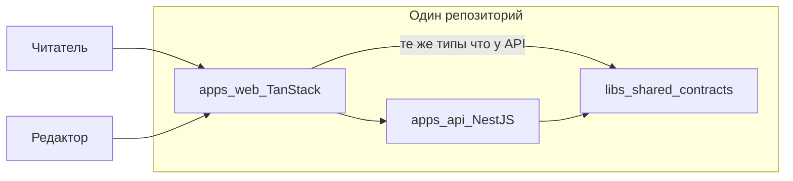

# История проекта: зачем мы это делаем

Этот файл — **сюжет**, а не инструкция. Здесь объясняется, _что мы строим_ и _зачем_ каждый шаг имел смысл. Технические детали, команды и списки файлов — в [уроках](./lessons/) и [дорожной карте](./development-roadmap.md).

## Как читать

| Документ                                           | Для чего                                       |
| -------------------------------------------------- | ---------------------------------------------- |
| **storytelling** (этот файл)                       | Понять общую картину и мотивацию               |
| [learning-path.md](./learning-path.md)             | Увидеть порядок шагов по фазам                 |
| [lessons/lesson-NNN-\*.md](./lessons/)             | Сделать шаг руками: что менять и как проверить |
| [development-roadmap.md](./development-roadmap.md) | Источник правды: что сделано и что дальше      |

**Новичку:** прочитайте сначала раздел «Большая цель», затем Track 0 целиком или по аркам. Перед каждым новым уроком заглядывайте в соответствующий блок «Шаг NNN» здесь — так урок перестанет ощущаться случайной настройкой.

---

## Большая цель

Мы строим **fullstack блог/CMS** — систему, где:

- **API** (NestJS) хранит данные, проверяет права, отдаёт контент и принимает правки из админки.
- **Публичный сайт** (TanStack Start) показывает посты с SEO и быстрой загрузкой.
- **Админка** (тоже TanStack Start) даёт редакторам черновики, превью и публикацию.

Всё это живёт в **одном репозитории** (монорепо): фронт, бэк и общие типы не разъезжаются по разным репозиториям. Это не «модный Nx ради Nx», а способ **договориться один раз** (типы ошибок, health, DTO) и не ломать клиент при каждом изменении API.

Сейчас (после шага 042) у нас есть **фундамент** (Track 0) и начало **платформы API** (Track 1): конфиг, health, единый формат ошибок и безопасная обработка сбоев. Домен блога (посты, пользователи, RBAC) — впереди.

---

## Track 0: фундамент рабочего места (шаги 001–032)

Track 0 — это не «фичи продукта», а **цех**, в котором потом собирают продукт\*\*: один lockfile, два приложения, общие правила качества, CI и документация. Без этого каждый следующий урок превращался бы в хаос из «а у меня не собирается».

### Арка A: один репозиторий и диспетчер задач (001–004)

Мы превратили разрозненный Nest-проект в **управляемое монорепо**: с корня ставятся зависимости, запускаются тесты и сборка; Nx знает проекты и кэширует задачи.

### Шаг 001: Корневые npm workspaces

**В сюжете:** Появился корневой `package.json`: репозиторий стал **одной семьёй пакетов**, а не папкой с вложенным проектом.

**Зачем:** Чтобы из корня делать `npm install`, `test`, `build` — как в «настоящих» командах, и чтобы позже добавить второе приложение без второго lockfile.

**Что унести с собой:** Workspaces — это «несколько `package.json`, один `package-lock.json`». Дисциплина корня важнее, чем кажется, когда пакет один.

→ [lesson-001](./lessons/lesson-001-root-npm-workspaces.md)

### Шаг 002: Политика Node/npm и LOCAL_SETUP

**В сюжете:** Зафиксировали **версию Node и npm** для всех: `.nvmrc`, `engines`, `engine-strict`, документ локальной настройки.

**Зачем:** «У меня работает» из-за разных версий Node — главный враг новичка и CI. Один toolchain = меньше сюрпризов.

**Что унести с собой:** Окружение — часть контракта проекта, как и API.

→ [lesson-002](./lessons/lesson-002-local-setup-and-node-policy.md)

### Шаг 003: Инициализация Nx

**В сюжете:** Подключили **Nx** — оркестратор задач поверх workspaces: `nx run api:build`, граф проектов, задел под кэш.

**Зачем:** Workspaces дают пакеты; Nx даёт **граф зависимостей и единые цели** (build, test, lint) для многих приложений.

**Что унести с собой:** Nx не заменяет npm — он **управляет тем, что уже есть** в монорепо.

→ [lesson-003](./lessons/lesson-003-nx-init.md)

### Шаг 004: Target defaults и inference

**В сюжете:** Настроили `nx.json`: имена целей, `namedInputs`, дефолты для кэша — чтобы `lint`/`test`/`build` вели себя предсказуемо.

**Зачем:** После `nx init` конфиг ещё «сырой»; без defaults каждый проект настраивают вручную и ломают кэш.

**Что унести с собой:** **Target** в Nx — это именованная команда проекта (`api:build`), не npm script сам по себе.

→ [lesson-004](./lessons/lesson-004-nx-targets-and-inference.md)

### Арка B: два приложения и единый стиль кода (005–011)

API переехал в `apps/api`, появился фронт в `apps/web`, общие TypeScript-пути, ESLint, Prettier и корневые скрипты через Nx.

### Шаг 005: Nest в `apps/api`

**В сюжете:** Бэкенд переехал из `app/` в **`apps/api`** — стандартная раскладка монорепо (`apps/*`).

**Зачем:** Место под `apps/web` и `libs/*` без переименований «на бегу» позже.

**Что унести с собой:** Структура папок — это **договор команды**, не косметика.

→ [lesson-005](./lessons/lesson-005-nest-apps-api-migration.md)

### Шаг 006: Корневой tsconfig и paths

**В сюжете:** Появился общий `tsconfig.base.json` и алиасы вроде `@blog/*` → `libs/*/src`.

**Зачем:** Импорты из shared-библиотек без `../../../` и с проверкой типов во всём репо.

**Что унести с собой:** Path mapping связывает **TypeScript и Nx-граф** — настраивайте их согласованно.

→ [lesson-006](./lessons/lesson-006-root-tsconfig-base-and-paths.md)

### Шаг 007: ESLint flat config в корне

**В сюжете:** Один **ESLint** на весь репозиторий (flat config), API и позже web под одни правила.

**Зачем:** Разный стиль и разные ошибки в api и web быстро превращаются в шум на ревью.

**Что унести с собой:** Линтер — автоматический напарник, который ловит классы багов до рантайма.

→ [lesson-007](./lessons/lesson-007-root-eslint-flat-config.md)

### Шаг 008: Prettier и EditorConfig

**В сюжете:** **Prettier** и **EditorConfig** выровняли форматирование независимо от редактора.

**Зачем:** Споры про пробелы vs табы — трата внимания; машина форматирует, люди думают о логике.

**Что унести с собой:** Format on save + общий конфиг = диффы только по смыслу.

→ [lesson-008](./lessons/lesson-008-root-prettier-and-editorconfig.md)

### Шаг 009: Корневые скрипты через Nx

**В сюжете:** `npm run build`, `test`, `lint` с корня стали **делегировать в Nx** (`nx run api:…`).

**Зачем:** Один вход для человека и CI: не нужно помнить, в какой папке какая команда.

**Что унести с собой:** Корневые scripts — **фасад** над Nx, а не дублирование логики.

→ [lesson-009](./lessons/lesson-009-root-scripts-via-nx.md)

### Шаг 010: Приложение `apps/web` (TanStack Start)

**В сюжете:** В монорепо появился **второй продукт** — фронт на TanStack Start, не «отдельный репозиторий».

**Зачем:** Блог без UI — только API; учебный трек сразу fullstack.

**Что унести с собой:** `apps/web` и `apps/api` — равноправные соседи под одним Nx.

→ [lesson-010](./lessons/lesson-010-apps-web-tanstack-start.md)

### Шаг 011: Цель `web:typecheck`

**В сюжете:** У web появилась отдельная Nx-цель **проверки типов** без полной production-сборки.

**Зачем:** Быстрая обратная связь в CI и локально — typecheck дешевле, чем build.

**Что унести с собой:** Разделяйте **typecheck** и **build** — разная скорость и разный смысл проверки.

→ [lesson-011](./lessons/lesson-011-web-typecheck-target.md)

### Арка C: общий язык между API и web (012–018)

Создали библиотеку контрактов, подключили её к обоим приложениям, настроили CORS, локальную БД и договор про переменные окружения.

### Шаг 012: Библиотека `shared-contracts`

**В сюжете:** Первый **`libs/shared-contracts`** — место для типов и констант, общих для API и web.

**Зачем:** Дублировать интерфейсы ошибок и health в двух apps — путь к рассинхрону.

**Что унести с собой:** **Контракт** — это код, который обещает форму данных обеим сторонам.

→ [lesson-012](./lessons/lesson-012-shared-contracts-lib.md)

### Шаг 013: Контракты в API

**В сюжете:** API **импортирует и собирается** с `shared-contracts` — бэкенд говорит на том же языке типов.

**Зачем:** Сборка ловит несовместимость контракта и реализации до деплоя.

**Что унести с собой:** Shared lib сначала в **одном потребителе**, потом во втором — меньше риска.

→ [lesson-013](./lessons/lesson-013-wire-shared-contracts-api.md)

### Шаг 014: Контракты в web

**В сюжете:** Web тоже подключил **shared-contracts** — фронт может опереться на те же типы (health, ошибки позже).

**Зачем:** Клиент и сервер читают один источник правды о форматах.

**Что унести с собой:** Fullstack-монорепо выигрывает, когда **тип уехал в lib**, а не скопирован.

→ [lesson-014](./lessons/lesson-014-wire-shared-contracts-web.md)

### Шаг 015: CORS и dev origins

**В сюжете:** API явно разрешает запросы с **origin фронта в dev** (и задел под prod).

**Зачем:** Браузер без CORS блокирует `localhost:3000` → `localhost:4000`; это не баг Nest, а политика безопасности.

**Что унести с собой:** CORS настраивают **осознанно по окружениям**, не `*` в проде.

→ [lesson-015](./lessons/lesson-015-cors-and-dev-origins.md)

### Шаг 016: PostgreSQL в Docker Compose

**В сюжете:** Локальная **Postgres** поднимается одной командой compose — как в «настоящих» проектах.

**Зачем:** CMS без БД — игрушка; одинаковый Postgres у всех разработчиков.

**Что унести с собой:** Инфра для dev — **код рядом с приложением** (`docker-compose`), не «установи сам».

→ [lesson-016](./lessons/lesson-016-postgres-compose-local-dev.md)

### Шаг 017: Файлы `.env.example`

**В сюжете:** Появились **шаблоны переменных окружения** без секретов — договор «что нужно приложению».

**Зачем:** Новый разработчик не угадывает `PORT` и `CORS_ORIGINS`; CI и доки ссылаются на один список.

**Что унести с собой:** `.env` в git не кладут; **`.env.example` — документация**, которую коммитят.

→ [lesson-017](./lessons/lesson-017-env-example-files.md)

### Шаг 018: README и runbook

**В сюжете:** Корневой README и краткие runbook для **api** и **web** — как поднять всё с нуля.

**Зачем:** Storytelling и уроки не заменяют «5 минут до первого запуска» для нового человека.

**Что унести с собой:** Документация запуска **живёт рядом с кодом** и обновляется со спринтами.

→ [lesson-018](./lessons/lesson-018-root-readme-runbook.md)

### Арка D: «взрослая» поставка и дисциплина (019–032)

CI, кэш Nx, affected, хуки, ADR, чеклист приёмки Track 0 — чтобы фундамент не развалился при росте команды.

### Шаг 019: Базовый CI (GitHub Actions)

**В сюжете:** Каждый push/PR гоняет **те же проверки**, что и локально: build, test, lint.

**Зачем:** «У меня зелёное» без CI — иллюзия; CI — общий арбитр качества.

**Что унести с собой:** CI должен быть **скучным повтором** локальных Nx-команд, не отдельной магией.

→ [lesson-019](./lessons/lesson-019-ci-pipeline-baseline.md)

### Шаг 020: Кэш Nx в CI

**В сюжете:** В CI сохраняют **`.nx/cache`** между прогонами — повторные сборки быстрее.

**Зачем:** Монорепо без кэша в CI дорого по времени и деньгам минут runner'а.

**Что унести с собой:** Nx cache — ускоритель; его нужно **явно восстанавливать** в CI.

→ [lesson-020](./lessons/lesson-020-nx-cache-in-ci.md)

### Шаг 021: Nx affected в CI

**В сюжете:** CI запускает задачи только для **затронутых проектов** (`nx affected`), а не всего графа каждый раз.

**Зачем:** С ростом репо полный `nx run-many` на каждый коммит становится расточительным.

**Что унести с собой:** **Affected** — связь git diff → граф Nx → минимальный набор проверок.

→ [lesson-021](./lessons/lesson-021-nx-affected-flow-in-ci.md)

### Шаг 022: Husky и lint-staged (опционально)

**В сюжете:** Задокументировали (и при желании включили) **проверки перед коммитом** — lint/format на staged файлах.

**Зачем:** Дешевле поймать опечатку до push, чем ждать красный CI.

**Что унести с собой:** Pre-commit — усилитель дисциплины, не замена CI.

→ [lesson-022](./lessons/lesson-022-optional-husky-lint-staged-policy.md)

### Шаг 023: Конвенции папки уроков

**В сюжете:** Зафиксировали **как называть и структурировать** `docs/lessons` — один шаг roadmap = один файл `lesson-NNN`.

**Зачем:** 300+ шагов без правил превратят документацию в свалку.

**Что унести с собой:** Нумерация урока **жёстко привязана** к номеру шага в roadmap.

→ [lesson-023](./lessons/lesson-023-lessons-folder-structure-conventions.md)

### Шаг 024: Политика релизов и changelog

**В сюжете:** Появился **заготовок процесса релиза** — как версионировать и что писать в changelog.

**Зачем:** Продукт рано или поздно выходит к пользователям; версии и заметки — часть доверия.

**Что унести с собой:** Релиз — не только git tag, а **сообщение пользователям**, что изменилось.

→ [lesson-024](./lessons/lesson-024-release-stub-and-changelog-policy.md)

### Шаг 025: Нормализация `.gitignore`

**В сюжете:** Привели **`.gitignore`** в порядок: артефакты Nx, dist, env, IDE — не попадают в git.

**Зачем:** Случайный коммит `dist/` или `.env` — боль и риск утечки секретов.

**Что унести с собой:** Чистый `git status` — признак зрелого репо.

→ [lesson-025](./lessons/lesson-025-normalize-gitignore.md)

### Шаг 026: Рекомендации VS Code (опционально)

**В сюжете:** `.vscode/extensions.json` подсказывает **полезные расширения** для TypeScript/Nx/ESLint.

**Зачем:** Одинаковый опыт в редакторе снижает трение у новичков.

**Что унести с собой:** Рекомендации редактора — мягкий стандарт, не обязательный закон.

→ [lesson-026](./lessons/lesson-026-optional-vscode-recommendations.md)

### Шаг 027: ADR-000 — почему Nx и TanStack Start

**В сюжете:** Записали **архитектурное решение** (ADR): зачем выбраны Nx и TanStack Start, какие альтернативы отвергли.

**Зачем:** Через полгода «почему не Next?» — без ADR ответ утерян в чате.

**Что унести с собой:** **ADR** — короткая память команды о важных развилках.

→ [lesson-027](./lessons/lesson-027-adr-000-nx-tanstack-start.md)

### Шаг 028: Заготовка threat model

**В сюжете:** Черновик **модели угроз** — что защищаем (auth, данные, админка) и от кого.

**Зачем:** Безопасность не начинается с «добавим JWT»; сначала — что может пойти не так.

**Что унести с собой:** Threat model можно начинать **простым markdown**, уточняя по мере Track 7.

→ [lesson-028](./lessons/lesson-028-threat-model-stub.md)

### Шаг 029: Smoke-скрипт health

**В сюжете:** Скрипт **быстро проверяет**, что API жив (`/health` или аналог) — для локали и автоматизации.

**Зачем:** «Сервер запустился» ≠ «сервер отвечает»; smoke ловит второе.

**Что унести с собой:** Дешёвая проверка после деплоя/старта экономит часы отладки.

→ [lesson-029](./lessons/lesson-029-health-smoke-script.md)

### Шаг 030: Чеклист приёмки Track 0

**В сюжете:** Явный **Definition of Done** для всего фундамента — можно ли идти в Track 1.

**Зачем:** Иначе «вроде всё настроили» без объективного списка готовности.

**Что унести с собой:** Чеклист — мост между **обучением** и **готовностью к фичам**.

→ [lesson-030](./lessons/lesson-030-track-0-acceptance-checklist.md)

### Шаг 031: Улучшения CI matrix (резерв)

**В сюжете:** Доработали **матрицу CI** (версии Node, параллельные job'ы) — запас прочности пайплайна.

**Зачем:** Один runner и одна версия Node иногда недостаточны для уверенности.

**Что унести с собой:** CI эволюционирует **маленькими шагами**, не большим взрывом.

→ [lesson-031](./lessons/lesson-031-ci-matrix-improvements.md)

### Шаг 032: Процесс ADR для отклонений (резерв)

**В сюжете:** Описали, **как менять roadmap** и фиксировать отклонения через ADR — не «тихо срезать угол».

**Зачем:** Учебный трек жёсткий по нумерации; реальная жизнь требует осознанных исключений.

**Что унести с собой:** Отклонение от плана **оформляется**, а не прячется в коммите.

→ [lesson-032](./lessons/lesson-032-adr-process-deviations.md)

**Итог Track 0:** у нас есть монорепо с api + web, общими контрактами, локальной БД, CI и документацией. Можно строить **платформенное поведение API**, не отвлекаясь на «где лежит проект».

---

## Track 1: платформа API (шаги 033–042)

Track 1 — **как API ведёт себя как сервис**: конфиг без сюрпризов, health для оркестраторов, предсказуемые и безопасные ошибки. Это основа, на которой потом лягут auth, посты и модерация.

### Арка E: конфиг и «жив ли сервис» (033–036)

### Шаг 033: ConfigModule и валидация env (Zod)

**В сюжете:** API при старте **читает и проверяет** переменные окружения через Zod; неверный `.env` — падение сразу, а не в середине запроса.

**Зачем:** «Тихий» дефолт порта или CORS ломает прод часами; fail-fast на старте честнее.

**Что унести с собой:** Конфиг — **схема + валидация**, синхронная с `.env.example`.

→ [lesson-033](./lessons/lesson-033-nest-config-and-env-validation.md)

### Шаг 034: Liveness `/health`

**В сюжете:** Эндпоинт **«процесс жив»** (Terminus) — для Kubernetes/Docker и мониторинга.

**Зачем:** Оркестратор должен отличать «упал процесс» от «не готов принимать трафик».

**Что унести с собой:** **Liveness** — про сам процесс, не про БД.

→ [lesson-034](./lessons/lesson-034-terminus-health-liveness.md)

### Шаг 035: Readiness `/health/ready`

**В сюжете:** Отдельная проверка **«готов обслуживать»** — зависимости (позже БД, кэш).

**Зачем:** Не слать трафик на инстанс, который ещё не подключился к Postgres.

**Что унести с собой:** **Readiness** может быть красным, пока liveness зелёный — это норма при старте.

→ [lesson-035](./lessons/lesson-035-readiness-probe-dependencies.md)

### Шаг 036: DTO health в `shared-contracts`

**В сюжете:** Форма ответа health **описана в контрактах** — API и клиенты согласованы.

**Зачем:** Свободный JSON health усложняет мониторинг и фронт; тип — документация.

**Что унести с собой:** Даже «служебные» эндпоинты заслуживают **общий контракт**.

→ [lesson-036](./lessons/lesson-036-health-response-dtos.md)

### Арка F: один язык ошибок (037–042)

### Шаг 037: Типы конверта ошибок API

**В сюжете:** В `shared-contracts` появился **единый конверт ошибки** — код, сообщение, детали.

**Зачем:** Каждый контроллер со своим `{ error: string }` — кошмар для фронта и тестов.

**Что унести с собой:** Ошибка API — **продуктовый интерфейс**, как и успешный JSON.

→ [lesson-037](./lessons/lesson-037-api-error-envelope-types.md)

### Шаг 038: Глобальный exception filter

**В сюжете:** Любое необработанное исключение превращается в **один формат ответа** и правильный HTTP-статус.

**Зачем:** Без фильтра Nest отдаёт разный HTML/JSON; клиент не может стабильно парсить ошибки.

**Что унести с собой:** Filter — **центральное место** маппинга exception → HTTP + body.

→ [lesson-038](./lessons/lesson-038-global-exception-filter.md)

### Шаг 039: Глобальный ValidationPipe

**В сюжете:** Входящие DTO **валидируются и очищаются** автоматически: лишние поля отбрасываются, типы приводятся.

**Зачем:** Ручная проверка в каждом методе — дыры в безопасности и усталость.

**Что унести с собой:** Whitelist + transform — защита от «лишних» полей в body.

→ [lesson-039](./lessons/lesson-039-global-validation-pipe.md)

### Шаг 040: Конвенции DTO и пример ресурса

**В сюжете:** Показали **как писать DTO** в этом проекте на примере `examples` — единый стиль для будущих сущностей.

**Зачем:** Платформа без примера остаётся абстракцией; один эталонный ресурс учит команду.

**Что унести с собой:** Конвенция важнее количества декораторов — **копируй образец**.

→ [lesson-040](./lessons/lesson-040-dto-validation-conventions.md)

### Шаг 041: Problem Details (`application/problem+json`)

**В сюжете:** Ошибки выровняли под **RFC 7807** — стандартный `Content-Type` и поля `title`, `detail`, `status`.

**Зачем:** Интеграции и клиенты узнают формат; меньше самодельных полей.

**Что унести с собой:** Стандарт — это **совместимость с экосистемой**, не бюрократия.

→ [lesson-041](./lessons/lesson-041-problem-details-alignment.md)

### Шаг 042: Безопасные unknown-ошибки

**В сюжете:** Клиент **никогда не видит** stack trace и внутренние тексты 5xx; в логах сервера — полная картина.

**Зачем:** Сообщение «connection string …» в JSON — утечка; пользователю нужен нейтральный «внутренняя ошибка».

**Что унести с собой:** **4xx** можно объяснять; **5xx** для клиента — одна безопасная фраза.

→ [lesson-042](./lessons/lesson-042-safe-unknown-errors.md)

### Шаг 043: Request ID и контекст запроса

**В сюжете:** У каждого запроса есть **ID**, который клиент видит в `X-Request-Id` и может процитировать в поддержку; при ошибке тот же ID попадает в `instance` в `problem+json`.

**Зачем:** Без сквозного ID нельзя связать ответ API, логи и трейсы одной ниткой.

**Что унести с собой:** Принимаем валидный клиентский ID или генерируем свой; храним в `AsyncLocalStorage`, не только в заголовке.

→ [lesson-043](./lessons/lesson-043-request-id-middleware.md)

### Шаг 044: Структурированное логирование

**В сюжете:** Логи API стали **однострочным JSON** — с полями `service`, `pid`, уровнем и сообщением; если запрос в ALS-контексте, в лог попадает тот же `requestId`, что и в заголовке ответа.

**Зачем:** Агрегаторы (Loki, ELK) и поддержка могут фильтровать по `requestId` и уровню; это основа для access-log (045), redaction (047) и трейсов (048+).

**Что унести с собой:** `nestjs-pino` + `LOG_LEVEL` в env; access-log намеренно отложен (`autoLogging: false`).

→ [lesson-044](./lessons/lesson-044-structured-logging.md)

### Шаг 045: Request logging interceptor

**В сюжете:** На каждый HTTP-запрос API пишет **access-log** — одну JSON-строку `request completed` с методом, путём, статусом и временем ответа в объекте `access`; тот же `requestId`, что в заголовке ответа.

**Зачем:** Поддержка и агрегаторы видят полную картину трафика по `requestId`, без включения `pino-http` autoLogging.

**Что унести с собой:** Глобальный interceptor + `autoLogging: false`; поля access-log не дублируют ключи `req`/`res` pino-http.

→ [lesson-045](./lessons/lesson-045-request-logging-interceptor.md)

### Шаг 046: Correlation ID

**В сюжете:** Каждый ответ API несёт **`X-Correlation-Id`**: клиент может прислать свой ID для цепочки вызовов, иначе API подставляет тот же ID, что и `X-Request-Id`. Оба ID попадают в JSON-логи; в `problem+json` по-прежнему `instance` = request id.

**Зачем:** Поддержка ищет по correlation id несколько связанных запросов; request id остаётся идентификатором одного HTTP-вызова.

**Что унести с собой:** Echo валидного `X-Correlation-Id`; fallback на request id; общая валидация trace id в `incoming-trace-id.ts`.

→ [lesson-046](./lessons/lesson-046-correlation-id.md)

### Шаг 047: Redaction в логах

**В сюжете:** Pino **редактирует** чувствительные поля (`password`, токены, `Authorization`, `Cookie` в `req.headers`) до записи в JSON — даже если разработчик случайно передал их в объект лога.

**Зачем:** Логи уходят в агрегаторы и к поддержке; утечка секретов там хуже, чем в ответе API (где 5xx уже «закрыты»). Redact — страховка перед Track 2 (auth).

**Что унести с собой:** Единый `LOG_REDACT_PATHS` + `redact` в `createPinoOptions`; access-log по-прежнему без body/headers.

→ [lesson-047](./lessons/lesson-047-log-redaction.md)

### Шаг 048: OpenTelemetry (noop wiring)

**В сюжете:** API **регистрирует** OpenTelemetry tracer provider до старта Nest: `BasicTracerProvider` без экспорта спанов. Глобальный `TracingModule` отдаёт injectable `API_TRACER` (`trace.getTracer('api')`).

**Зачем:** Проводка tracing без collector'а в dev/CI; в 049 подключим W3C propagation, позже — экспорт и метрики.

**Что унести с собой:** `import './instrumentation'` первой строкой в `main.ts`; `trace.setGlobalTracerProvider()` (OTel JS 2.x); DI через `API_TRACER`.

→ [lesson-048](./lessons/lesson-048-opentelemetry-noop.md)

### Шаг 049: W3C trace context на входящем HTTP

**В сюжете:** API **читает** заголовок `traceparent`, поднимает server span в том же trace и держит active context на весь Nest pipeline (`TraceContextMiddleware` перед request id). Export по-прежнему noop — проверка через e2e и curl smoke.

**Зачем:** Сквозной trace от gateway/другого сервиса; без propagation каждый запрос — новый изолированный root.

**Что унести с собой:** `W3CTraceContextPropagator` + `AsyncLocalStorageContextManager`; `propagation.extract` → `startSpan(SERVER)` → `span.end()` на `res.finish`; в тестах — `setDelegate` на proxy provider.

→ [lesson-049](./lessons/lesson-049-trace-context-propagation.md)

### Шаг 050: Prometheus `/metrics` stub

**В сюжете:** API отдаёт `GET /metrics` в формате Prometheus text exposition: default process metrics через `prom-client` и отдельный registry, не смешивая с JSON health checks.

**Зачем:** Точка подключения scraper'а (Prometheus/Grafana позже); ops видят CPU/memory/process без кастомной инструментализации приложения.

**Что унести с собой:** Отдельный `MetricsModule`; `collectDefaultMetrics` один раз в `onModuleInit`; `Content-Type: text/plain; version=0.0.4`; health и metrics — разные контракты.

→ [lesson-050](./lessons/lesson-050-metrics-endpoint-stub.md)

### Шаг 051: `/api/v1` + ops на корне

**В сюжете:** Прикладной API переезжает под **`/api/v1`** (`configureApiHttp`: global prefix + URI versioning). `/health`, `/health/ready`, `/metrics` остаются на корне через `VERSION_NEUTRAL` и exclude в prefix.

**Зачем:** Отделить продуктовые маршруты (auth, CMS) от Kubernetes/Prometheus; зафиксировать версию в URL для клиентов.

**Что унести с собой:** `API_V1_BASE`; `createApiTestApp` = prod bootstrap; legacy `/examples` → 404; smoke API через `/health`.

→ [lesson-051](./lessons/lesson-051-api-prefix-and-versioning.md) · [routing-and-versioning.md](./api/routing-and-versioning.md)

### Шаг 052 — Graceful shutdown

**В сюжете:** API корректно завершается по **SIGTERM**: `configureApiShutdown` включает Nest shutdown hooks, `PostgresPoolLifecycle` закрывает pool, `ApiShutdownService` пишет structured log `application shutdown` с полем `signal`. Smoke: `npm run shutdown:smoke` (spawn built API → health → SIGTERM → exit 0).

**Зачем:** Kubernetes и Docker останавливают процесс сигналом, а не «убийством» — нужно drain HTTP и освободить ресурсы.

**Что унести с собой:** `enableShutdownHooks` в bootstrap; smoke требует `nx run api:build`; порт smoke по умолчанию `4099`.

→ [lesson-052](./lessons/lesson-052-graceful-shutdown-hooks.md)

### Шаг 053 — Request timeout / abort + shutdown grace

**В сюжете:** `RequestTimeoutInterceptor` ограничивает handler (`REQUEST_TIMEOUT_MS`, по умолчанию 30s) → **408** + `REQUEST_TIMEOUT` в problem+json; `clientAbort$` отменяет работу при обрыве клиента. `InFlightRequestsService` + `ApiShutdownCoordinator`: по SIGTERM новые запросы → **503**, ожидание drain до `SHUTDOWN_GRACE_PERIOD_MS`, затем `app.close()` или `exit(1)`.

**Зачем:** Не держать workers на «зависших» handler'ах; не писать в закрытый сокет; дать in-flight запросам завершиться перед остановкой pod.

**Что унести с собой:** Timeout interceptor регистрируется **до** logging; `enableShutdownHooks([])` + coordinator на сигналах; e2e override токена `REQUEST_TIMEOUT_MS`.

→ [lesson-053](./lessons/lesson-053-request-timeout-abort.md)

**Итог Track 1 (пока):** API умеет стартовать с проверенным конфигом, отчитываться о здоровье, отвечать на сбои предсказуемо и безопасно, помечать запросы request/correlation id, писать структурированные логи, access-log, редактировать секреты в JSON, держать OTel tracer provider (noop export), продолжать W3C trace с входящего HTTP, отдавать Prometheus metrics stub на `/metrics`, обслуживать версионированный API на `/api/v1`, корректно завершаться по SIGTERM с grace period и ограничивать длительность HTTP-обработки. Дальше — contract tests (054+), затем auth и CMS.

---

## Сквозные принципы (обновляется по ходу курса)

1. **Один репозиторий — один договор.** Workspaces + Nx + shared-contracts держат api и web в синхроне.
2. **Fail-fast.** Неверный env или контракт ломают сборку/старт рано, не в проде ночью.
3. **Контракты в `libs`, не копипаст.** Health и ошибки — общий язык фронта и бэка.
4. **Один шаг — одна идея.** Урок не смешивает CI и auth; проще учиться и ревьюить.
5. **Тест там, где есть поведение.** Инфраструктурные шаги проверяются иначе, но проверяются явно.
6. **Безопасность ошибок по умолчанию.** Клиент не доверяют внутренним деталям 5xx.
7. **Документация — часть поставки.** Урок, storytelling, roadmap и README дополняют друг друга.

---

## Где мы сейчас

- **Завершено:** Track 0 (001–032) и начало Track 1 (033–053).
- **Есть в коде:** монорепо (api + web + shared-contracts), CI, локальный Postgres, конфиг с Zod, health liveness/readiness, единый pipeline ошибок до безопасных 5xx, request/correlation ID middleware + ALS, structured JSON logging (pino) с redaction, HTTP access-log interceptor, OpenTelemetry noop tracer wiring (`TracingModule`, `API_TRACER`), W3C `traceparent` propagation (`TraceContextMiddleware`), Prometheus `/metrics` stub (`MetricsModule`, `prom-client`), публичный API под `/api/v1` (`configureApiHttp`, ops на корне), graceful shutdown (`configureApiShutdown`, `ShutdownModule`, `shutdown:smoke`), request timeout/abort interceptor + shutdown grace (`RequestLifecycleModule`, `ApiShutdownCoordinator`, `REQUEST_TIMEOUT_MS` / `SHUTDOWN_GRACE_PERIOD_MS`).
- **Ещё нет в сюжете продукта:** пользователи, JWT, посты CMS, публичные страницы блога — это следующие треки roadmap.

---

## Что дальше

Следующие шаги Track 1 (см. [development-roadmap.md](./development-roadmap.md)):

- **054–056:** contract tests, чеклист приёмки Track 1.

Затем **Track 2 (auth)** — база данных, пользователи, регистрация, сессии — и дальше домен CMS и публичный сайт.

После каждого нового урока сюда добавляется блок **«Шаг NNN»**; при необходимости уточняются арки и этот раздел.

---

## Мини-глоссарий

| Термин               | Простыми словами                                      |
| -------------------- | ----------------------------------------------------- |
| **Монорепо**         | Много приложений и библиотек в одном git-репозитории  |
| **Workspace (npm)**  | Связка пакетов с общим `node_modules` и lockfile      |
| **Nx target**        | Именованная задача проекта (`api:build`)              |
| **Shared contracts** | Общие TypeScript-типы/константы для api и web         |
| **Liveness**         | «Процесс не завис»                                    |
| **Readiness**        | «Можно слать пользовательский трафик»                 |
| **DTO**              | Объект, описывающий вход/выход API; валидируется pipe |
| **Problem Details**  | Стандартный JSON-формат ошибки для HTTP API           |
| **ADR**              | Короткая запись «почему мы так решили»                |
