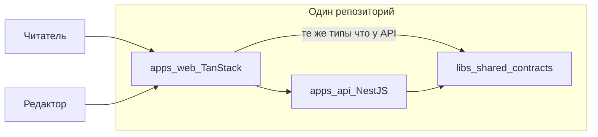

# История проекта: зачем мы это делаем

Этот файл — **не инструкция**, а разговор с наставником: почему мы строим блог/CMS именно так, какие проблемы решаем до того, как открывать урок с командами и файлами. Технические шаги, проверки и списки изменений — в [уроках](./lessons/) и [дорожной карте](./development-roadmap.md).

## Как читать

| Документ                                                                              | Для чего                                                         |
| ------------------------------------------------------------------------------------- | ---------------------------------------------------------------- |
| **storytelling** (этот файл)                                                          | Погрузиться в контекст: сцена → проблема → что сделали в проекте |
| [learning-path.md](./learning-path.md)                                                | Увидеть порядок шагов по фазам                                   |
| [lessons/lesson-NNN-\*.md](./lessons/)                                                | Сделать шаг руками                                               |
| [development-roadmap.md](./development-roadmap.md)                                    | Источник правды: что сделано и что дальше                        |
| [lesson-authoring-guide.md](./lesson-authoring-guide.md#documentation-sync-checklist) | Чеклист: куда вносить изменения после каждого шага               |

**Рекомендуемый порядок:** прочитайте раздел «Большая цель», затем **главу целиком** (I–IX). Перед конкретным уроком достаточно одной строки в таблице «Шаги этой главы» — так урок перестаёт ощущаться случайной настройкой.

### Оглавление глав

|                               | Глава                                                                       | Шаги         |
| ----------------------------- | --------------------------------------------------------------------------- | ------------ |
| **Track 0 — фундамент**       |                                                                             |              |
| I                             | [Один репозиторий — один договор](#глава-i-один-репозиторий--один-договор)  | 001–004      |
| II                            | [Два продукта, одни правила](#глава-ii-два-продукта-одни-правила)           | 005–011      |
| III                           | [Общий язык до первой фичи](#глава-iii-общий-язык-до-первой-фичи)           | 012–018      |
| IV                            | [Дисциплина, которая держит темп](#глава-iv-дисциплина-которая-держит-темп) | 019–032      |
| **Track 1 — платформа API**   |                                                                             |              |
| V                             | [API честно стартует](#глава-v-api-честно-стартует)                         | 033–036      |
| VI                            | [Ошибки — часть доверия](#глава-vi-ошибки--часть-доверия)                   | 037–042, 054 |
| VII                           | [Найти один запрос среди тысяч](#глава-vii-найти-один-запрос-среди-тысяч)   | 043–047      |
| VIII                          | [Система видна снаружи](#глава-viii-система-видна-снаружи)                  | 048–051      |
| IX                            | [Уважительная остановка](#глава-ix-уважительная-остановка)                  | 052–053      |
| **Track 2 — auth и identity** |                                                                             |              |
| X                             | [Кто вы и что вам можно](#глава-x-кто-вы-и-что-вам-можно)                   | 057+         |

---

## Большая цель

Представьте редакцию, которая ведёт блог: читатель открывает статью в браузере, редактор — черновик в админке, а между ними — **API**, который хранит тексты, проверяет права и не отдаёт лишнего. Мы строим именно такую **fullstack систему (блог/CMS)**:

- **API** (NestJS) — данные, валидация, права, публикация.
- **Публичный сайт** (TanStack Start) — посты, SEO, быстрая загрузка.
- **Админка** (тот же стек) — черновики, превью, публикация.

Всё живёт в **одном репозитории** (монорепо): фронт, бэк и общие типы не расходятся по разным git-репозиториям. Это способ **договориться один раз** — о формате ошибок, health, DTO — и не ломать клиент при каждом изменении API.

Сейчас (после шага 068) у нас готов **фундамент** (Track 0), **платформа API** (Track 1, 033–056) и в Track 2 есть **таблица `users`**, **Argon2id-хэшер**, **`UserService`** с нормализацией email, **`POST /api/v1/auth/register`**, **409 CONFLICT** при дубликате, **`POST /api/v1/auth/login`** с **`accessToken`**, **`JwtStrategy` + `JwtAuthGuard`**, **`GET /api/v1/auth/me`**, декоратор **`@CurrentUser()`** на защищённых маршрутах. Дальше — refresh/RBAC. Домен блога — посты, публичный сайт — ещё впереди (Tracks 3–4).

---

## Track 0: фундамент рабочего места

Track 0 — не «фичи продукта», а **цех**, в котором потом собирают продукт. Без него каждый следующий урок превращается в «а у меня не собирается» — и вы тратите силы не на логику блога, а на расхождения окружения.

---

## Глава I. Один репозиторий — один договор

**Шаги:** 001–004

### Сцена

У вас когда-нибудь было два «гаража» для одного проекта: бэкенд в одной папке со своим `node_modules`, фронт — в другом, у коллеги — третья версия Node? Вы правите API, а `npm test` с корня не запускается. Команда тратит день на «у меня работает», хотя задача — одна строка кода.

### Что болит, если этого нет

Разные lockfile, разные версии Node, нет единой точки сборки. Каждый новый человек в команде поднимает проект по-своему. CI и локальная машина живут в разных мирах.

### Намерение главы

Собрать **одну воспроизводимую мастерскую**: с корня ставятся зависимости, запускаются тесты и сборка; оркестратор знает проекты и умеет кэшировать повторяющуюся работу.

### Как это выглядело в нашем проекте

Мы начали с того, что превратили разрозненный Nest-проект в **семью пакетов под одним корнем** — один `package-lock.json`, одна команда `npm install`. Затем зафиксировали **версию Node и npm** для всех: это не прихоть, а договор такой же важный, как контракт API. «У меня на 20-й Node» и «у CI на 18-й» — классический источник красных пайплайнов без видимой причины в коде.

Дальше подключили **Nx** — не вместо npm, а поверх workspaces: единые цели `build`, `test`, `lint`, граф зависимостей и задел под кэш. И сразу настроили **target defaults** в `nx.json`, чтобы `lint` и `test` вели себя предсказуемо и кэш не ломался из-за разрозненных конфигов. К концу главы из корня можно честно сказать: «собери и проверь всё» — без памятки «сначала зайди в `apps/api`».

### Что стоит унести с собой

- Workspaces — это несколько `package.json` и **один** lockfile; дисциплина корня важнее, чем кажется, когда пакет один.
- Версия Node — **часть контракта проекта**, не личная настройка ноутбука.
- Nx **управляет** тем, что уже есть в монорепо; target — именованная задача проекта (`api:build`), не произвольный скрипт.

### Шаги этой главы

| Шаг | Суть                                         | Урок                                                              |
| --- | -------------------------------------------- | ----------------------------------------------------------------- |
| 001 | Корневые npm workspaces — одна семья пакетов | [lesson-001](./lessons/lesson-001-root-npm-workspaces.md)         |
| 002 | Политика Node/npm и LOCAL_SETUP              | [lesson-002](./lessons/lesson-002-local-setup-and-node-policy.md) |
| 003 | Инициализация Nx — оркестратор задач         | [lesson-003](./lessons/lesson-003-nx-init.md)                     |
| 004 | Target defaults и inference в nx.json        | [lesson-004](./lessons/lesson-004-nx-targets-and-inference.md)    |

---

## Глава II. Два продукта, одни правила

**Шаги:** 005–011

### Сцена

В здании открывают второй цех — витрину для гостей (сайт) — рядом с кухней (API). Если у цехов разные чертежи, разные «правила гигиены» и разные вывески на дверях, через месяц никто не понимает, где что лежит. Ревью превращается в спор о стиле, а не о логике.

### Что болит, если этого нет

Бэкенд в случайной папке, фронт «потом прикрутим отдельным репо», импорты через `../../../`, ESLint только на половине кода. Fullstack остается словом в резюме, а не в структуре репозитория.

### Намерение главы

Разместить **два приложения** (`api` и `web`) в привычной раскладке монорепо, выровнять TypeScript, линт и форматирование и дать **один вход** с корня для сборки и проверок.

### Как это выглядело в нашем проекте

Мы перенесли Nest в **`apps/api`** — не косметика, а место под соседа `apps/web` и библиотеки `libs/*` без переезда «на бегу». Общий `tsconfig.base.json` и алиасы `@blog/*` убрали лабиринт относительных импортов. Один **ESLint** на весь репозиторий и **Prettier** с EditorConfig сняли бесконечные диффы про пробелы: машина форматирует, люди обсуждают поведение.

Корневые `npm run build`, `test`, `lint` стали **фасадом над Nx** — и для вас, и для CI одна и та же дверь. Появился **`apps/web`** на TanStack Start: блог без UI — только API; учебный трек сразу fullstack. Отдельная цель **`web:typecheck`** дала быструю проверку типов без тяжёлой production-сборки — в CI и локально это экономит минуты и нервы.

### Что стоит унести с собой

- Структура папок — **договор команды**, не украшение.
- Path mapping связывает TypeScript и граф Nx — настраивайте согласованно.
- Разделяйте **typecheck** и **build**: разная скорость и разный смысл проверки.

### Шаги этой главы

| Шаг | Суть                                 | Урок                                                                 |
| --- | ------------------------------------ | -------------------------------------------------------------------- |
| 005 | Nest переехал в apps/api             | [lesson-005](./lessons/lesson-005-nest-apps-api-migration.md)        |
| 006 | Корневой tsconfig и paths            | [lesson-006](./lessons/lesson-006-root-tsconfig-base-and-paths.md)   |
| 007 | ESLint flat config в корне           | [lesson-007](./lessons/lesson-007-root-eslint-flat-config.md)        |
| 008 | Prettier и EditorConfig              | [lesson-008](./lessons/lesson-008-root-prettier-and-editorconfig.md) |
| 009 | Корневые скрипты через Nx            | [lesson-009](./lessons/lesson-009-root-scripts-via-nx.md)            |
| 010 | Приложение apps/web (TanStack Start) | [lesson-010](./lessons/lesson-010-apps-web-tanstack-start.md)        |
| 011 | Цель web:typecheck                   | [lesson-011](./lessons/lesson-011-web-typecheck-target.md)           |

---

## Глава III. Общий язык до первой фичи

**Шаги:** 012–018

### Сцена

Кухня и зал ресторана говорят на разных языках: официант приносит заказ «суп дня», а на кухне слышат «борщ». В разработке это выглядит так: фронт ждёт `{ status: 'ok' }`, API отдаёт `{ healthy: true }`, а CORS в браузере молча блокирует запрос — и кажется, что «бэкенд сломан».

### Что болит, если этого нет

Дублированные типы в api и web, расхождение после первого же рефакторинга, локальная БД «у кого как получилось», секреты в чате вместо шаблона env. Новый разработчик тратит день на угадывание переменных.

### Намерение главы

Завести **общий язык данных** (контракты), подключить оба приложения, поднять локальную инфраструктуру и описать запуск так, чтобы storytelling и уроки не заменяли runbook.

### Как это выглядело в нашем проекте

Появилась **`libs/shared-contracts`** — место для типов и констант, которые обещают одну форму и API, и web. Сначала контракты подключили к API, затем к web: так проще поймать несовместимость на сборке, чем в проде ночью. Мы явно настроили **CORS для dev** — браузерная политика безопасности, не «баг Nest». Локальная **Postgres в Docker Compose** дала одинаковую БД у всех; шаблоны **`.env.example`** — договор «какие переменные нужны», без секретов в git. Корневой README и runbook для api/web закрыли вопрос «как поднять всё с нуля за пять минут».

### Что стоит унести с собой

- Контракт — код, который **обещает форму** обеим сторонам; копипаст в apps — путь к рассинхрону.
- CORS настраивают **осознанно по окружениям**, не `*` в проде.
- `.env.example` — документация, которую коммитят; `.env` — личное и секретное.

### Шаги этой главы

| Шаг | Суть                        | Урок                                                             |
| --- | --------------------------- | ---------------------------------------------------------------- |
| 012 | Библиотека shared-contracts | [lesson-012](./lessons/lesson-012-shared-contracts-lib.md)       |
| 013 | Контракты в API             | [lesson-013](./lessons/lesson-013-wire-shared-contracts-api.md)  |
| 014 | Контракты в web             | [lesson-014](./lessons/lesson-014-wire-shared-contracts-web.md)  |
| 015 | CORS и dev origins          | [lesson-015](./lessons/lesson-015-cors-and-dev-origins.md)       |
| 016 | PostgreSQL в Docker Compose | [lesson-016](./lessons/lesson-016-postgres-compose-local-dev.md) |
| 017 | Файлы .env.example          | [lesson-017](./lessons/lesson-017-env-example-files.md)          |
| 018 | README и runbook            | [lesson-018](./lessons/lesson-018-root-readme-runbook.md)        |

---

## Глава IV. Дисциплина, которая держит темп

**Шаги:** 019–032

### Сцена

Перед открытием спектакля делают **генеральную репетицию**: свет, звук, декорации — по чеклисту, а не «вроде всё включилось». В софте репетиция — это CI, кэш, правила документации и явный список «фундамент готов». Иначе команда из двух человек растёт до пяти — и каждый пушит по-своему.

### Что болит, если этого нет

«У меня зелёное» без общего арбитра; CI, который гоняет весь монорепо на каждый коммит; 300 уроков без соглашений об именах; решения «почему не Next» теряются в чате; секреты в логах и в git.

### Намерение главы

Закрепить **общий арбитр качества** (CI + Nx cache + affected), дисциплину документации и релизов, память о решениях (ADR) и честный **Definition of Done** для Track 0.

### Как это выглядело в нашем проекте

В GitHub Actions завели **те же проверки**, что локально — CI как скучное эхо, не отдельная магия. Кэш Nx в CI и **affected** сократили время и деньги: с ростом репозитория полный прогон на каждый коммит становится роскошью. Опционально описали pre-commit — дешевле поймать опечатку до push. Зафиксировали **конвенции уроков** (один шаг roadmap = один `lesson-NNN`), заготовку **релиза и changelog**, аккуратный **`.gitignore`**, рекомендации VS Code.

**ADR-000** объясняет, почему Nx и TanStack Start — память команды на годы. Черновик **threat model** напоминает: безопасность начинается с «что может пойти не так», а не с «добавим JWT в пятницу». **Smoke health** отделяет «процесс запустился» от «процесс отвечает». **Чеклист приёмки Track 0** — мост между обучением и готовностью к фичам. Резервные шаги **031–032** (матрица CI, процесс ADR для отклонений) — запас прочности: отклонение от плана **оформляется**, а не прячется в коммите.

### Что стоит унести с собой

- CI повторяет локальные Nx-команды; pre-commit — усилитель, не замена.
- Affected связывает git diff с минимальным набором проверок.
- ADR и threat model можно начинать простым markdown и уточнять позже.

### Шаги этой главы

| Шаг | Суть                                | Урок                                                                       |
| --- | ----------------------------------- | -------------------------------------------------------------------------- |
| 019 | Базовый CI (GitHub Actions)         | [lesson-019](./lessons/lesson-019-ci-pipeline-baseline.md)                 |
| 020 | Кэш Nx в CI                         | [lesson-020](./lessons/lesson-020-nx-cache-in-ci.md)                       |
| 021 | Nx affected в CI                    | [lesson-021](./lessons/lesson-021-nx-affected-flow-in-ci.md)               |
| 022 | Husky и lint-staged (опционально)   | [lesson-022](./lessons/lesson-022-optional-husky-lint-staged-policy.md)    |
| 023 | Конвенции папки уроков              | [lesson-023](./lessons/lesson-023-lessons-folder-structure-conventions.md) |
| 024 | Политика релизов и changelog        | [lesson-024](./lessons/lesson-024-release-stub-and-changelog-policy.md)    |
| 025 | Нормализация .gitignore             | [lesson-025](./lessons/lesson-025-normalize-gitignore.md)                  |
| 026 | Рекомендации VS Code (опционально)  | [lesson-026](./lessons/lesson-026-optional-vscode-recommendations.md)      |
| 027 | ADR-000: Nx и TanStack Start        | [lesson-027](./lessons/lesson-027-adr-000-nx-tanstack-start.md)            |
| 028 | Заготовка threat model              | [lesson-028](./lessons/lesson-028-threat-model-stub.md)                    |
| 029 | Smoke-скрипт health                 | [lesson-029](./lessons/lesson-029-health-smoke-script.md)                  |
| 030 | Чеклист приёмки Track 0             | [lesson-030](./lessons/lesson-030-track-0-acceptance-checklist.md)         |
| 031 | Улучшения CI matrix (резерв)        | [lesson-031](./lessons/lesson-031-ci-matrix-improvements.md)               |
| 032 | Процесс ADR для отклонений (резерв) | [lesson-032](./lessons/lesson-032-adr-process-deviations.md)               |

**Итог Track 0:** монорепо с api + web, общими контрактами, локальной БД, CI и документацией. Можно строить платформенное поведение API, не отвлекаясь на «где лежит проект».

---

## Track 1: платформа API

Track 1 — **как API ведёт себя как сервис**, которому доверяют ops и который не стыдно показать фронту: честный старт, понятные ошибки, прослеживаемость, метрики, версии URL, корректная остановка. На этом лягут auth, посты и модерация.

---

## Глава V. API честно стартует

**Шаги:** 033–036

### Сцена

Врач не начинает приём, пока не убедится, что пациент в сознании и приборы включены. API, который стартует с «тихим» неверным портом или CORS и падает на первом реальном запросе в три ночи — тот же сюжет: проблема обнаружена слишком поздно.

### Что болит, если этого нет

Неверный `.env` всплывает в середине сценария; оркестратор шлёт трафик на инстанс, который ещё не подключился к БД; health отдаёт «свободный JSON», который никто не парсит одинаково.

### Намерение главы

**Fail-fast** при старте, разделить «процесс жив» и «готов принимать трафик», зафиксировать форму health в контрактах.

### Как это выглядело в нашем проекте

При запуске API **читает и проверяет** переменные окружения через Zod — неверный конфиг роняет процесс сразу, а не в середине оплаты. Появились **liveness** (`/health`) и **readiness** (`/health/ready`): оркестратор отличает «упал процесс» от «ещё не готов». Форма ответа health переехала в **shared-contracts** — и API, и клиенты читают один словарь, даже для «служебного» эндпоинта.

### Что стоит унести с собой

- Конфиг — схема + валидация, синхронная с `.env.example`.
- Liveness — про процесс; readiness — про зависимости и трафик.

### Шаги этой главы

| Шаг | Суть                               | Урок                                                                 |
| --- | ---------------------------------- | -------------------------------------------------------------------- |
| 033 | ConfigModule и валидация env (Zod) | [lesson-033](./lessons/lesson-033-nest-config-and-env-validation.md) |
| 034 | Liveness /health                   | [lesson-034](./lessons/lesson-034-terminus-health-liveness.md)       |
| 035 | Readiness /health/ready            | [lesson-035](./lessons/lesson-035-readiness-probe-dependencies.md)   |
| 036 | DTO health в shared-contracts      | [lesson-036](./lessons/lesson-036-health-response-dtos.md)           |

---

## Глава VI. Ошибки — часть доверия

**Шаги:** 037–042, 054

### Сцена

Гость в ресторане спрашивает, почему нет блюда. Хороший официант объясняет понятно; плохой — зачитывает внутренний складской отчёт с артикулами. API без единого формата ошибок заставляет фронт гадать; утечка stack trace в JSON — как складской отчёт на столе гостя.

### Что болит, если этого нет

Каждый контроллер со своим `{ error: string }`; валидация вручную в каждом методе; 5xx с текстом «connection string …»; фронт и тесты не могут стабильно парсить ответ.

### Намерение главы

Сделать ошибку **продуктовым интерфейсом**: один конверт, глобальный filter, автоматическая валидация DTO, стандарт Problem Details, безопасные 5xx.

### Как это выглядело в нашем проекте

В контрактах описали **единый конверт ошибки**. Глобальный exception filter переводит любое исключение в предсказуемый HTTP-статус и тело. ValidationPipe с whitelist и transform закрывает дыры «лишних полей» в body. Эталонный ресурс **examples** показал, как писать DTO в этом проекте. Ошибки выровняли под **RFC 9457** Problem Details (`application/problem+json`; RFC 7807 obsolete, wire без изменений). Для неизвестных 5xx клиент видит **нейтральную фразу**, полная картина остаётся в логах сервера. На шаге **054** закрепили договор **автотестами**: все platform-коды проходят Zod-схему из `shared-contracts`, без legacy-полей Nest в JSON; health probes по-прежнему не problem+json.

### Что стоит унести с собой

- Ошибка API — интерфейс, как успешный JSON.
- 4xx можно объяснять пользователю; 5xx для клиента — одна безопасная формулировка.

### Шаги этой главы

| Шаг | Суть                           | Урок                                                             |
| --- | ------------------------------ | ---------------------------------------------------------------- |
| 037 | Типы конверта ошибок API       | [lesson-037](./lessons/lesson-037-api-error-envelope-types.md)   |
| 038 | Глобальный exception filter    | [lesson-038](./lessons/lesson-038-global-exception-filter.md)    |
| 039 | Глобальный ValidationPipe      | [lesson-039](./lessons/lesson-039-global-validation-pipe.md)     |
| 040 | Конвенции DTO и пример ресурса | [lesson-040](./lessons/lesson-040-dto-validation-conventions.md) |
| 041 | Problem Details (problem+json) | [lesson-041](./lessons/lesson-041-problem-details-alignment.md)  |
| 042 | Безопасные unknown-ошибки      | [lesson-042](./lessons/lesson-042-safe-unknown-errors.md)        |
| 054 | Contract-тесты формата ошибок  | [lesson-054](./lessons/lesson-054-error-json-contract-tests.md)  |

---

## Глава VII. Найти один запрос среди тысяч

**Шаги:** 043–047

### Сцена

Пользователь пишет в поддержку: «Оплата не прошла в 14:03». В логах — тысячи строк. Без **номера заказа** вы ищете иголку вслепую. В распределённой системе этот номер — request id и correlation id; без них инцидент растягивается на часы.

### Что болит, если этого нет

Нельзя связать ответ API, лог и трейс; в логах оказываются пароли и токены; access-log дублирует или размазывает поля; поддержка не может процитировать id из ответа.

### Намерение главы

Проследить **один HTTP-вызов** от заголовка ответа до строки в агрегаторе логов — и не утекать секретами в JSON.

### Как это выглядело в нашем проекте

Каждый запрос получил **request id** (принимаем валидный от клиента или генерируем), храним в контексте запроса, отдаём в `X-Request-Id` и в `instance` problem+json. Логи стали **структурированным JSON** (pino): один уровень — одна строка, при наличии контекста — тот же request id. **Access-log** на каждый HTTP-запрос дополняет картину трафика без включения тяжёлого autoLogging. **Correlation id** связывает цепочку вызовов; один HTTP-вызов по-прежнему идентифицируется request id. **Redaction** вычищает пароли, токены, Authorization и Cookie до записи — страховка перед Track 2 (auth).

### Что стоит унести с собой

- Request id — один звонок; correlation id — цепочка звонков.
- Access-log и секреты в объекте лога — разные риски; redact закрывает второй.

### Шаги этой главы

| Шаг | Суть                          | Урок                                                              |
| --- | ----------------------------- | ----------------------------------------------------------------- |
| 043 | Request ID и контекст запроса | [lesson-043](./lessons/lesson-043-request-id-middleware.md)       |
| 044 | Структурированное логирование | [lesson-044](./lessons/lesson-044-structured-logging.md)          |
| 045 | Request logging interceptor   | [lesson-045](./lessons/lesson-045-request-logging-interceptor.md) |
| 046 | Correlation ID                | [lesson-046](./lessons/lesson-046-correlation-id.md)              |
| 047 | Redaction в логах             | [lesson-047](./lessons/lesson-047-log-redaction.md)               |

---

## Глава VIII. Система видна снаружи

**Шаги:** 048–051

### Сцена

У самолёта есть приборная панель и адресные таблички на дверях: пилот видит давление, диспетчер — номер рейса. Ops смотрит на метрики и health; другие сервисы продолжают **тот же trace**, если прислали заголовок. Прикладные маршруты («меню ресторана») не смешивают с техническими («аварийный выход»).

### Что болит, если этого нет

Каждый запрос — изолированный остров в трейсинге; нет точки для Prometheus; продуктовые URL и `/health` живут в одной куче; клиенты не знают версию API в пути.

### Намерение главы

Подготовить **проводку наблюдаемости** (OTel, W3C propagation), отдать **метрики**, отделить **версионированный API** от ops-эндпоинтов на корне.

### Как это выглядело в нашем проекте

Зарегистрировали OpenTelemetry **tracer provider** без экспорта в dev/CI — проводка до collector'а. На входящем HTTP читаем **`traceparent`**, поднимаем server span в том же trace на весь Nest pipeline. **`GET /metrics`** отдаёт Prometheus text exposition (process metrics), отдельно от JSON health. Прикладной API переехал под **`/api/v1`**; `/health`, `/health/ready`, `/metrics` остались на корне для Kubernetes и scraper'а.

### Что стоит унести с собой

- Tracing можно включать поэтапно: сначала propagation, потом export.
- Health и metrics — разные контракты и аудитория, чем REST ресурсы CMS.

### Шаги этой главы

| Шаг | Суть                               | Урок                                                            |
| --- | ---------------------------------- | --------------------------------------------------------------- |
| 048 | OpenTelemetry (noop wiring)        | [lesson-048](./lessons/lesson-048-opentelemetry-noop.md)        |
| 049 | W3C trace context на входящем HTTP | [lesson-049](./lessons/lesson-049-trace-context-propagation.md) |
| 050 | Prometheus /metrics stub           | [lesson-050](./lessons/lesson-050-metrics-endpoint-stub.md)     |
| 051 | /api/v1 + ops на корне             | [lesson-051](./lessons/lesson-051-api-prefix-and-versioning.md) |

---

## Глава IX. Уважительная остановка

**Шаги:** 052–053

### Сцена

Ресторан закрывается не обесточиванием зала в момент заказа: сначала дослуживают гостей за столиками, потом гасят свет. Kubernetes при деплое шлёт **SIGTERM** — API должен перестать принимать новых, дождаться текущих и освободить соединения с БД.

### Что болит, если этого нет

Обрыв запросов без ответа; запись в закрытый сокет; pool Postgres остаётся висеть; «зависший» handler держит worker минутами.

### Намерение главы

Корректно завершать процесс и **ограничивать длительность** обработки HTTP с понятным ответом клиенту.

### Как это выглядело в нашем проекте

Включили shutdown hooks: по SIGTERM API пишет structured log, закрывает pool, завершает процесс; smoke проверяет сценарий «запуск → health → SIGTERM → exit 0». **Request timeout** обрывает слишком долгие handler'ы с 408 и кодом `REQUEST_TIMEOUT` в problem+json; обрыв клиента отменяет работу. При shutdown новые запросы получают **503**, in-flight запросы **дренируются** в пределах grace period, затем закрытие приложения.

### Что стоит унести с собой

- Graceful shutdown — часть контракта с оркестратором, не «nice to have».
- Timeout interceptor и logging — порядок регистрации имеет значение.

### Шаги этой главы

| Шаг | Суть                                     | Урок                                                          |
| --- | ---------------------------------------- | ------------------------------------------------------------- |
| 052 | Graceful shutdown (SIGTERM)              | [lesson-052](./lessons/lesson-052-graceful-shutdown-hooks.md) |
| 053 | Request timeout / abort + shutdown grace | [lesson-053](./lessons/lesson-053-request-timeout-abort.md)   |

**Итог Track 1:** API стартует с проверенным конфигом, отчитывается о здоровье, отвечает на сбои предсказуемо и безопасно (wire-формат ошибок зафиксирован contract-тестами), помечает запросы, пишет структурированные логи, поддерживает tracing и metrics stub, обслуживает версионированный API на `/api/v1`, корректно останавливается.

---

## Приёмка Track 1

**Шаги:** 055–056

### Как это выглядело в нашем проекте

Track 1 длинный: десятки механизмов, каждый со своим уроком. **Чеклист приёмки** (055) — мост между «мы прошли уроки» и «можно строить auth»: одна страница с командами (`api:test`, `shutdown:smoke`, curl health/metrics) и ссылками на уроки 033–054. Шаг **056** закрыл observability follow-ups: OTLP по желанию, `traceId` в логах, HTTP histogram в Prometheus, тихие ops-маршруты в access-log — зафиксировано в [ADR-002](./adr/002-platform-observability.md). Track 1 завершён; дальше auth.

### Шаги

| Шаг | Суть                               | Урок                                                                    |
| --- | ---------------------------------- | ----------------------------------------------------------------------- |
| 055 | Чеклист приёмки Track 1            | [lesson-055](./lessons/lesson-055-track-1-acceptance-checklist.md)      |
| 056 | Observability follow-ups (reserve) | [lesson-056](./lessons/lesson-056-platform-observability-follow-ups.md) |

---

## Глава X. Кто вы и что вам можно

**Шаги:** 057+ (Track 2 — Auth and Identity)

### Сцена

Редакция не может публиковать от имени «кого угодно»: нужны учётные записи, вход, роли — кто редактор, кто только читатель админки. Платформа API уже умеет ошибки, логи и health; теперь ей нужен **слой данных** для людей.

### Что болит, если этого нет

Каждый auth-эндпоинт пишет сырой SQL; схема БД живёт в головах; тесты без Postgres падают в CI; readiness и домен дерутся за одно соединение без договора.

### Намерение главы

Построить **идентичность и права** на предсказуемом стеке: ORM, миграции, сущности пользователя, JWT, RBAC — до первого поста в CMS.

### Как это выглядело в нашем проекте

Первый шаг Track 2 — **bootstrap TypeORM**: `DatabaseModule`, `synchronize` выключен, сущности подтянутся через `autoLoadEntities`. **058** — канонический `DATABASE_URL` в Zod. **059** — migration workflow: CLI `DataSource` на том же URL, `db:migrate` / revert / smoke, baseline-миграция без доменных таблиц (цепочка `typeorm_migrations` готова к `User` на 060). **060** — сущность `User`, `UsersModule` с `forFeature`, миграция `CreateUsersTable`: `uuid` с `gen_random_uuid()`, уникальный `email`, `password_hash`, метки времени; в CLI добавлен glob `*.entity.{ts,js}` для будущего `migration:generate`. **061** — `PasswordHasherService` на Argon2id (`@node-rs/argon2`): единая точка `hash` / `verify` для колонки `password_hash`, экспорт из `UsersModule`, unit-тесты без Postgres. **062** — `UserService`: `create` собирает сущность через хэшер и `save`, `findByEmail` — тонкий запрос к репозиторию; сервис экспортируется из `UsersModule`, покрыт unit-тестами с моками репозитория. **063** — `AuthModule`: `POST /api/v1/auth/register`, `CreateRegisterBodyDto`, `AuthService` делегирует в `UserService` и отдаёт `RegisterUserResponse` из `shared-contracts`; e2e мокает `UserService`, чтобы не тянуть Postgres. **064** — нормализация email (`trim` + lowercase) в `UserService`, проактивная проверка дубликата и маппинг гонки `UQ_users_email` в `ConflictException` → 409 problem+json вместо 500; хелпер `isPostgresUniqueViolation` для переиспользования. **065** — `POST /api/v1/auth/login`: `AuthService` ищет пользователя через `findByEmail`, сверяет пароль через `verify`, отдаёт `LoginUserResponse` без `passwordHash`; при неизвестном email и неверном пароле — одно сообщение `Invalid email or password` и **401 UNAUTHORIZED**, чтобы не перечислять аккаунты. **066** — `JwtAccessTokenService` на `@nestjs/jwt`: `signForUser` / `verify` с payload `{ sub: userId }`, secret и TTL из Zod env; нейтральное `Invalid access token` на любой сбой verify; сервис экспортируется из `AuthModule`. **067** — Passport (`passport-custom`): `JwtStrategy` делегирует verify в тот же сервис, `JwtAuthGuard` на `GET /auth/me`; login отдаёт `accessToken` в `LoginUserResponse`; без Bearer — 401 с тем же neutral message. **068** — `@CurrentUser()` и `getAuthRequestUser`: контроллеры читают `req.user` без `@Req()`, unit-тесты на `ExecutionContext`. **069** — таблица `refresh_tokens`: opaque refresh хранится как SHA-256 `token_hash`, FK на `users` с cascade, self-FK `replaced_by_token_id` для цепочки rotation; `RefreshTokenService` умеет persist/find active/revoke/markReplaced, экспортируется из `AuthModule`; login и access JWT без изменений. Nest по-прежнему не гоняет миграции при старте; readiness — отдельный `pg` pool. CI без Docker Postgres.

### Шаги этой главы

| Шаг | Суть                               | Урок                                                                         |
| --- | ---------------------------------- | ---------------------------------------------------------------------------- |
| 057 | Postgres + TypeORM bootstrap       | [lesson-057](./lessons/lesson-057-database-module-postgres-orm-bootstrap.md) |
| 058 | `DATABASE_URL` в validated env     | [lesson-058](./lessons/lesson-058-datasource-config-database-url.md)         |
| 059 | Migration workflow + baseline      | [lesson-059](./lessons/lesson-059-migration-workflow-baseline-schema.md)     |
| 060 | `User` entity + `users` table      | [lesson-060](./lessons/lesson-060-user-entity-indexes.md)                    |
| 061 | Password hasher (Argon2id)         | [lesson-061](./lessons/lesson-061-password-hasher-service.md)                |
| 062 | `UserService` create/find email    | [lesson-062](./lessons/lesson-062-user-service-create-find-by-email.md)      |
| 063 | `POST /auth/register` + DTO        | [lesson-063](./lessons/lesson-063-auth-register-dto.md)                      |
| 064 | Unique email + friendly CONFLICT   | [lesson-064](./lessons/lesson-064-unique-email-friendly-conflict.md)         |
| 065 | `POST /auth/login`                 | [lesson-065](./lessons/lesson-065-auth-login.md)                             |
| 066 | JWT access token sign/verify       | [lesson-066](./lessons/lesson-066-jwt-access-token-service.md)               |
| 067 | JwtStrategy + AuthGuard + /me      | [lesson-067](./lessons/lesson-067-jwt-strategy-auth-guard.md)                |
| 068 | `@CurrentUser()` decorator         | [lesson-068](./lessons/lesson-068-current-user-decorator.md)                 |
| 069 | Refresh token entity + persistence | [lesson-069](./lessons/lesson-069-refresh-token-entity-persistence.md)       |

---

## Сквозные принципы

1. **Один репозиторий — один договор.** Workspaces, Nx и shared-contracts держат api и web в синхроне; споры решаются типами, а не перепиской в чате.
2. **Fail-fast.** Неверный env или контракт должен «щёлкнуть» на сборке или старте, а не в проде ночью.
3. **Контракты в libs, не копипаст.** Health, ошибки, будущие DTO постов — общий язык.
4. **Один шаг — одна идея в уроке; одна глава — одно намерение в storytelling.** Так проще учиться и ревьюить.
5. **Проверяйте поведение явно.** Где нет unit-теста — smoke, CI или чеклист; «вроде работает» не считается. Изменения `apps/api/src` без `*.spec.ts` в том же коммите блокирует pre-commit (tests-first).
6. **Безопасность ошибок и логов по умолчанию.** Клиент не видит внутренности 5xx; агрегатор логов не должен видеть пароли.
7. **Документация — часть поставки.** Урок, эта история, roadmap и README отвечают на разные вопросы и дополняют друг друга.

---

## Где мы сейчас

- **Завершено:** Track 0 (001–032), Track 1 (033–056), Track 2 в части ORM, домена пользователя и auth: 057–069 (TypeORM, `DATABASE_URL`, миграции, `User`, `PasswordHasherService`, `UserService` с нормализацией email, **`POST /auth/register`**, **409 при дубликате**, **`POST /auth/login`** с **`accessToken`**, **`JwtStrategy` + `JwtAuthGuard`**, **`GET /auth/me`**, **`@CurrentUser()`**, **`refresh_tokens` + `RefreshTokenService`**).
- **В коде:** всё из Track 1 плюс `DatabaseModule`, CLI миграций, `UsersModule`, **`AuthModule`** с register/login/me, Bearer guard, JWT sign/verify, декоратор `CurrentUser` и persistence refresh (хэш в БД); readiness через `pg` на `POSTGRES_*`.
- **Ещё не в сюжете продукта:** HTTP refresh/logout, RBAC, посты CMS, публичный сайт — шаги 070+ и Tracks 3–4.

---

## Что дальше

Следующие шаги (см. [development-roadmap.md](./development-roadmap.md)):

- **Track 2, шаг 070:** `POST /auth/refresh` + rotation semantics; затем logout (071), reuse policy (072) и RBAC (081+).

После каждого нового урока обновляйте **соответствующую главу** (narrative + строка в таблице) и при необходимости разделы «Где мы сейчас» и «Что дальше». Для Track 2+ добавляйте новые главы с заголовком и намерением, не возвращаясь к 53 отдельным блокам `### Шаг`.

### Заглушки будущих глав (Track 2+)

| Глава (черновик)          | Намерение                                                                                                                                                                                                   |
| ------------------------- | ----------------------------------------------------------------------------------------------------------------------------------------------------------------------------------------------------------- |
| X. Кто вы и что вам можно | Сделано: ORM, `DATABASE_URL`, миграции, `User`, Argon2id, `UserService`, register + CONFLICT + login + JWT + Bearer guard + `/me` + `@CurrentUser` + refresh persistence; далее refresh HTTP/rotation, RBAC |
| XI. Редакция и контент    | Домен CMS на API                                                                                                                                                                                            |
| XII. Витрина для читателя | Публичный TanStack Start, SEO                                                                                                                                                                               |
| …                         | См. roadmap Tracks 3–8                                                                                                                                                                                      |

---

## Мини-глоссарий

| Термин               | Простыми словами                                     |
| -------------------- | ---------------------------------------------------- |
| **Монорепо**         | Много приложений и библиотек в одном git-репозитории |
| **Workspace (npm)**  | Связка пакетов с общим `node_modules` и lockfile     |
| **Nx target**        | Именованная задача проекта (`api:build`)             |
| **Shared contracts** | Общие TypeScript-типы/константы для api и web        |
| **Request ID**       | Идентификатор одного HTTP-запроса (поддержка, логи)  |
| **Correlation ID**   | Идентификатор цепочки связанных запросов             |
| **Liveness**         | «Процесс не завис»                                   |
| **Readiness**        | «Можно слать пользовательский трафик»                |
| **DTO**              | Объект входа/выхода API; валидируется pipe           |
| **Problem Details**  | Стандартный JSON-формат ошибки (RFC 9457)            |
| **ADR**              | Короткая запись «почему мы так решили»               |
